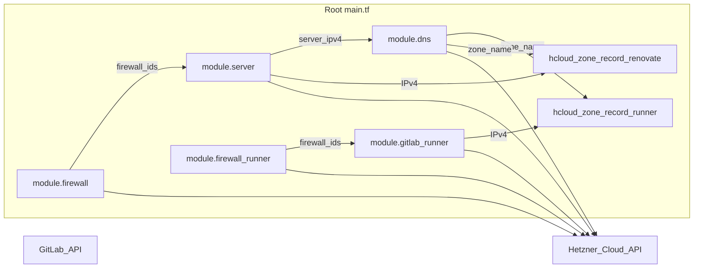
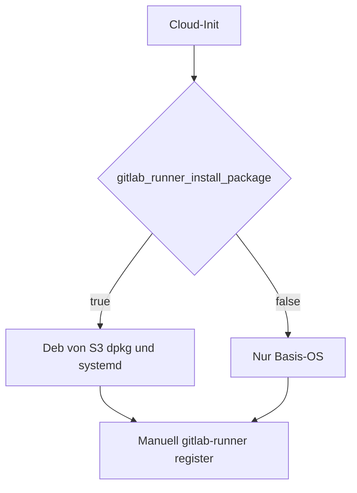

# gitlab-terraform-hcloud

Dieses Repository enthält Terraform-Code für **Hetzner Cloud**: einen Hauptserver mit Firewall, optionalem PTR und einer **Hetzner-DNS-Zone** inklusive Web- und Mail-Records. Über **`gitlab_install_mode`** steuerst du die **GitLab-Plattform auf dem Server**: aus (`none`), **Hetzner-App-Image** plus Omnibus-Cloud-Init (`hetzner_app`), oder **Debian-VM mit Docker Compose** (`docker_compose`: GitLab CE, Traefik, PostgreSQL, optional **Mend Renovate CE**). Optional eine **zweite VM als GitLab Runner** (`cpx22`) mit automatischer Installation der offiziellen GitLab-Runner-`.deb`-Pakete.

Unabhängig davon kann **`enable_gitlab_resources`** Gruppen und Projekte per **GitLab-API** in [`gitlab.tf`](gitlab.tf) anlegen (Provider [`gitlabhq/gitlab`](https://registry.terraform.io/providers/gitlabhq/gitlab/latest/docs)).

Provider: [`hetznercloud/hcloud`](https://registry.terraform.io/providers/hetznercloud/hcloud/latest/docs), [`hashicorp/random`](https://registry.terraform.io/providers/hashicorp/random/latest/docs), [`gitlabhq/gitlab`](https://registry.terraform.io/providers/gitlabhq/gitlab/latest/docs) (siehe [`provider.tf`](provider.tf)).

## Inhaltsverzeichnis

- [gitlab-terraform-hcloud](#gitlab-terraform-hcloud)
  - [Inhaltsverzeichnis](#inhaltsverzeichnis)
  - [Architektur](#architektur)
    - [Provider](#provider)
  - [Voraussetzungen](#voraussetzungen)
  - [Schnellstart](#schnellstart)
  - [Variablen (Root)](#variablen-root)
    - [Ohne Default (bei `apply` erforderlich)](#ohne-default-bei-apply-erforderlich)
    - [Mit Default (optional überschreibbar)](#mit-default-optional-überschreibbar)
  - [Outputs](#outputs)
  - [GitLab-Installationsmodi](#gitlab-installationsmodi)
    - [`hetzner_app` (Hetzner App-Image)](#hetzner_app-hetzner-app-image)
    - [`docker_compose` (GitLab CE + Traefik)](#docker_compose-gitlab-ce--traefik)
    - [Renovate CE (`docker_compose`)](#renovate-ce-docker_compose)
  - [GitLab-Provider-Ressourcen (`gitlab.tf`)](#gitlab-provider-ressourcen-gitlabtf)
  - [GitLab Runner (optionale zweite VM)](#gitlab-runner-optionale-zweite-vm)
  - [Module im Detail](#module-im-detail)
  - [Sicherheit und Betrieb](#sicherheit-und-betrieb)
  - [Cloud-Init und user\_data](#cloud-init-und-user_data)
  - [Qualitätssicherung (lokal / CI)](#qualitätssicherung-lokal--ci)
  - [Bekannte Einschränkungen](#bekannte-einschränkungen)
  - [Weiterführende Links](#weiterführende-links)

## Architektur

Die Wurzelkonfiguration [`main.tf`](main.tf) bindet die Module **Firewall** → **Server** → **DNS** (A-Record für den Haupt-Host). Optional zusätzlich: **Firewall (Runner)** → **Server (Runner)** und eine **`hcloud_zone_record`** für den Runner in derselben DNS-Zone. Alle Ressourcen nutzen dieselbe Hetzner-Cloud-API.



Optional (nur bei `enable_gitlab_resources = true`): [`gitlab.tf`](gitlab.tf) nutzt die **GitLab-API** (`gitlab_group`, `gitlab_project`) — unabhängig von `gitlab_install_mode`.

| Modul / Ressource | Inhalt (Kurz) |
|--------|----------------|
| [`modules/firewall`](modules/firewall) | `hcloud_firewall`: eingehend u. a. SSH 22, **TCP 2424**, HTTP/HTTPS 80/443, DNS 53 (TCP/UDP), ICMP, Node Exporter; **ausgehend** DNS 53 (TCP/UDP), HTTP 80, HTTPS 443; bei **`gitlab_smtp_enabled`** zusätzlich SMTP (**TCP `gitlab_smtp_port`**, z. B. 587/465). |
| [`modules/server`](modules/server) | `hcloud_ssh_key`, `hcloud_server` (Image z. B. Ubuntu 24.04, `gitlab` bei `hetzner_app`, oder `gitlab_docker_host_image` bei `docker_compose` im Root), Firewall-IDs, optional `hcloud_rdns`, optional `user_data` (Cloud-Init für GitLab oder Runner). |
| [`modules/dns`](modules/dns) | `hcloud_zone` (primary) und Records: Web-A-Record, Mail-A/AAAA/MX, Autoconfig/Autodiscover, DMARC/DKIM/SPF, CAA, TLSA, SRV. |
| `module.firewall_runner` + `module.gitlab_runner` + `hcloud_zone_record.gitlab_runner` | Nur bei `enable_gitlab_runner = true`: Firewall (SSH/ICMP ein, Egress DNS/HTTP/HTTPS), **cpx22**-Server, A-Record **`<gitlab_runner_dns_label>.<zone>`**. |
| `hcloud_zone_record.renovate` | Nur bei `docker_compose` + **`gitlab_docker_renovate_enabled`**: A-Record **`<gitlab_docker_renovate_dns_label>.<zone>`** (Standard: `renovate.<zone>`) → gleiche Server-IPv4 wie GitLab. |

### Provider

In [`provider.tf`](provider.tf):

- **`hcloud`** (Standard) und **`hcloud.dns`** (Alias, gleiches Token): Server, Firewall, DNS (`providers = { hcloud.dns = hcloud.dns }` im DNS-Modul).
- **`gitlab`**: `token = var.gitlab_api_token`, `base_url = var.gitlab_api_url`. Wird nur für Ressourcen in [`gitlab.tf`](gitlab.tf) benötigt, wenn **`enable_gitlab_resources = true`**.
- **`random`**: Passwörter für `docker_compose` (GitLab-`root`, PostgreSQL, optional Renovate-Webhook und Server-API-Secret).

## Voraussetzungen

- [Terraform](https://developer.hashicorp.com/terraform/install) **>= 1.14.4** (empfohlen; CI nutzt 1.14.4) **oder** [OpenTofu](https://opentofu.org/docs/intro/install/) **>= 1.9.0** (z. B. 1.12.x) — siehe [Terraform und OpenTofu](#terraform-und-opentofu)
- Hetzner Cloud **API-Token** mit passenden Rechten (Server, Firewalls, SSH-Keys, DNS je nach Nutzung)
- Öffentlicher **SSH-Schlüssel** für den Root-Zugang auf dem Server
- Für DNS: Domain, die du in Hetzner DNS verwalten willst (Zonenname = Variable `domain_cicd_showcase_de` bzw. dein Override)
- Für **`enable_gitlab_resources = true`**: GitLab-Instanz erreichbar unter **`gitlab_api_url`**, **Personal/Project Access Token** mit Rechten zum Anlegen von Gruppen und Projekten (`gitlab_api_token`)
- Für **`gitlab_docker_renovate_enabled = true`** (nur mit `gitlab_install_mode = docker_compose`): [Mend Renovate CE](https://www.mend.io/renovate-community/) **License Key**, GitLab-**PAT** für den Renovate-Bot (`gitlab_docker_renovate_gitlab_pat`, `api`-Scope auf deiner Instanz)

## Schnellstart

1. Repository klonen und ins Verzeichnis wechseln.
2. **`terraform.tfvars`** anlegen (wird per [`.gitignore`](.gitignore) ignoriert – keine Secrets committen). Orientierung: [`terraform.tfvars.example`](terraform.tfvars.example). Mindestens die in der Tabelle unten als **ohne Default** geführten Variablen setzen.
3. Module und Provider laden:

   ```bash
   terraform init
   ```

4. Plan und Apply:

   ```bash
   terraform plan
   terraform apply
   ```

Nach erfolgreichem Apply zeigen [`outputs.tf`](outputs.tf) u. a. öffentliche IPs, SSH-Befehl und DNS-Zoneninformationen an.

## Variablen (Root)

Terraform verlangt **alle Variablen ohne `default`** (siehe unten).

### Ohne Default (bei `apply` erforderlich)

| Name | Typ | Sensitiv | Beschreibung |
|------|-----|----------|--------------|
| `hcloud_token` | string | ja | Hetzner **Cloud** API-Token ([Console](https://console.hetzner.cloud/)) |
| `ssh_public_key` | string | nein | Eine Zeile aus `*.pub`, **oder** leer lassen und `ssh_public_key_file` setzen |
| `hetzner_api_key` | string | ja | Hetzner **DNS** API-Token ([dns.hetzner.com](https://dns.hetzner.com/)) — **nicht** `hcloud_token`; bei `docker_compose` → `HETZNER_API_TOKEN` in Traefik `.env` |

### Mit Default (optional überschreibbar)

| Name | Default (Kurz) | Hinweis |
|------|------------------|---------|
| `server_name` | `web1` | Name des `hcloud_server` |
| `server_type` | `cpx32` | Hetzner-Typ des GitLab-Hauptservers (`cx*`, `cpx*`, `ccx*`) |
| `location` | `fsn1` | z. B. `fsn1`, `nbg1`, `hel1`, `ash`, `hil` |
| `gitlab_install_mode` | `none` | `none`: kein GitLab; `hetzner_app`: Image `gitlab` + [`templates/gitlab-cloud-init.yaml.tpl`](templates/gitlab-cloud-init.yaml.tpl); `docker_compose`: `gitlab_docker_host_image` (Standard `debian-13`) + [`templates/gitlab-docker-cloud-init.yaml.tpl`](templates/gitlab-docker-cloud-init.yaml.tpl), Stack unter `/opt/gitlab` |
| `gitlab_docker_host_image` | `debian-13` | Nur `docker_compose`: Hetzner-Image-Slug für den Hauptserver (vor Apply mit `hcloud image list` prüfen; bei abweichendem Slug z. B. `debian-12` setzen) |
| `gitlab_docker_traefik_image` | `traefik:v3.7.1` | Traefik-Container in `docker_compose` |
| `gitlab_docker_gitlab_ce_image` | `gitlab/gitlab-ce:18.10.5-ce.0` | GitLab-CE-Image-Tag in `docker_compose` |
| `gitlab_docker_postgres_image` | `postgres:16-alpine` | PostgreSQL-Container-Image (Version wie bei Traefik pinnen, z. B. `postgres:17`) |
| `gitlab_docker_renovate_enabled` | `false` | `true`: Mend **Renovate CE** im Compose-Stack; nur bei `docker_compose` |
| `gitlab_docker_renovate_ce_image` | `ghcr.io/mend/renovate-ce:9.1.0` | Image-Tag pinnen ([Container-Pakete](https://github.com/mend/renovate-ce-ee/pkgs/container/renovate-ce)) |
| `gitlab_docker_renovate_dns_label` | `renovate` | DNS + Traefik-Host: `<label>.<zone>` |
| `gitlab_docker_renovate_license_key` | `""` | Mend-Lizenz (sensitiv); Pflicht wenn Renovate aktiv |
| `gitlab_docker_renovate_gitlab_pat` | `""` | GitLab-PAT für Renovate (sensitiv); Pflicht wenn Renovate aktiv |
| `gitlab_docker_traefik_acme_enabled` | `false` | `true`: Traefik Let’s Encrypt (DNS-01 via Hetzner); nur bei `gitlab_install_mode = docker_compose`; ACME-Mail über `gitlab_letsencrypt_email` bzw. Fallback `gitlab-acme@<zone>` |
| `gitlab_docker_backup_enabled` | `true` | **`docker_compose`** oder **`hetzner_app`**: `gitlab_rails` Backup in `gitlab.rb`, Host-Cron + Backup-Skript |
| `gitlab_docker_backup_keep_time` | `604800` | Aufbewahrung in Sekunden (Standard 7 Tage); `0` = alle Archive behalten ([Backup-Doku](https://docs.gitlab.com/omnibus/settings/backups.html)) |
| `gitlab_docker_backup_cron` | `0 3 * * *` | Cron-Zeitplan auf dem GitLab-Host für `gitlab-backup create` (fünf Felder) |
| `gitlab_signup_enabled` | `false` | Nur **`docker_compose`**: `gitlab_rails['gitlab_signup_enabled']` — Registrierung auf der Anmeldeseite |
| `enable_gitlab_resources` | `false` | `true`: Gruppe/Projekte in [`gitlab.tf`](gitlab.tf) per GitLab-Provider; erfordert **`gitlab_api_token`** |
| `gitlab_api_token` | `""` | GitLab API-Token (sensitiv); Pflicht bei `enable_gitlab_resources = true` (min. 8 Zeichen, keine Leerzeichen) |
| `gitlab_api_url` | `https://gitlab.com` | Basis-URL der GitLab-Instanz für den Provider (`https://gitlab.example.com` bei Self-Hosted) |
| `server_image` | `ubuntu-24.04` | Nur bei `gitlab_install_mode = none` (Hetzner-Image-Slug) |
| `gitlab_dns_record_name` | `gitlab` | Relativer A-Record bei GitLab: FQDN = `<name>.<zone>` |
| `gitlab_letsencrypt_email` | leer | ACME-Kontakt; leer → `gitlab-acme@<zone>` (nur relevant, wenn LE aktiv) |
| `gitlab_smtp_enabled` | `false` | Nur **`docker_compose`**: `gitlab_rails['smtp_enable']` in `gitlab.rb` ([SMTP-Doku](https://docs.gitlab.com/omnibus/settings/smtp.html)) |
| `gitlab_smtp_address` | `""` | SMTP-Host; Pflicht bei `gitlab_smtp_enabled = true` |
| `gitlab_smtp_port` | `587` | SMTP-Port (587 STARTTLS, 465 SMTPS) |
| `gitlab_smtp_user_name` / `gitlab_smtp_password` | `""` | Optional (sensitiv); nur gesetzt wenn nicht leer |
| `gitlab_smtp_domain` | `""` | HELO-Domain; leer → `domain_cicd_showcase_de` |
| `gitlab_smtp_authentication` | `login` | `login`, `plain`, `cram_md5`, `none` |
| `gitlab_smtp_enable_starttls_auto` | `true` | STARTTLS (typisch Port 587) |
| `gitlab_smtp_tls` | `false` | Implicit TLS (typisch Port 465) |
| `gitlab_email_from` | `""` | Absender; Pflicht bei aktiviertem SMTP |
| `gitlab_email_reply_to` | `""` | Optional Reply-To |
| `gitlab_letsencrypt_enabled` | `false` | Nur **`hetzner_app`**: `https` + integriertes LE (HTTP-01). Bei `docker_compose` **`gitlab_docker_traefik_acme_enabled`** verwenden. |
| `gitlab_bootstrap_wait_seconds` | `120` | Wartezeit im **per-instance**-Skript vor `gitlab-ctl reconfigure` (DNS) |
| `enable_gitlab_runner` | `false` | `true`: zweite VM (**cpx22**), Runner-Firewall, A-Record + PTR auf `<gitlab_runner_dns_label>.<zone>` |
| `gitlab_runner_install_package` | `true` | Bei aktivem Runner: Cloud-Init installiert **.deb**-Pakete von GitLab S3 (siehe [manuelle Installation](https://docs.gitlab.com/runner/install/linux-manually/)), Log `/var/log/gitlab-runner-terraform-bootstrap.log`; `false`: nur Ubuntu |
| `gitlab_runner_server_name` | `runner05` | Name des `hcloud_server` für den Runner |
| `gitlab_runner_dns_label` | `runner05` | Relativer A-Record-Name; FQDN = `<label>.<domain_cicd_showcase_de>` (z. B. `runner05.cicd-showcase.de`; ursprünglich oft als Platzhalter `runner05.example.com` gedacht) |
| `gitlab_runner_image` | `ubuntu-24.04` | Hetzner-Image-Slug für die Runner-VM |
| `gitlab_runner_location` | `""` | Leer = gleiche Region wie `location`; sonst z. B. `fsn1`, `nbg1`, … |
| `create_hcloud_dns_zone` | `true` | `false`, wenn die Zone in Hetzner DNS schon existiert (vermeidet 409 *Zone already exists*) |
| `ssh_public_key_file` | `""` | Optional: Pfad zur `.pub`-Datei (z. B. `~/.ssh/id_ed25519.pub`), überschreibt `ssh_public_key` |
| `site_url` | `https://cicd-showcase.de` | Wird als Output `website_url` ausgegeben |
| `domain_cicd_showcase_de` | `cicd-showcase.de` | DNS-Zonenname; bei GitLab auch Basis für `gitlab_fqdn` und PTR |
| `mail_server_ipv4` | IPv4 | Mail-**A**-Record (`module.dns`) |
| `mail_server_ipv6` | IPv6 | Mail-**AAAA**-Record |
| `mail_server_cname_target` | Hostname | CNAME-Ziel Autoconfig/Autodiscover |
| `dns_tlsa_name` | TLSA-Name | z. B. `_25._tcp.mail.example.com` |
| `mail_mx_value` | Priorität + Mail-Host | MX-Record in der Zone |
| `dmarc_value` | DMARC-String | muss `v=DMARC1` enthalten |
| `dkim_value` | DKIM-String | Lange Werte werden im DNS-Modul in Chunks aufgeteilt |
| `spf_value` | SPF-String | muss `v=spf1` enthalten |
| `tlsa_value` | TLSA-Felder | Für den TLSA-Record im Modul |
| `srv_value` | SRV-Ziel | Ziel-Hostnamen mit **trailing dot** |
| `iodef_value` / `contact_value` | `mailto:…` | CAA iodef/contact |

[`main.tf`](main.tf) übergibt an `module.dns` u. a. **`mail_server_ipv4`**, **`mail_server_ipv6`**, **`mail_server_cname_target`**, **`dns_tlsa_name`** (Defaults in [`variables.tf`](variables.tf)). **`spf_value`** ist separat; bei `ip4:` in SPF zur Mail-A-Record-IP passend halten.

## Outputs

| Output | Bedeutung |
|--------|-----------|
| `server_ip` | Öffentliche IPv4 des Servers |
| `server_ipv6` | Öffentliche IPv6 |
| `server_name` | Servername |
| `server_id` | Hetzner-Server-ID |
| `server_status` | Status des Servers |
| `firewall_id` / `firewall_name` | Firewall in Hetzner Cloud |
| `ssh_connection` | Vorschlag: `ssh root@<ipv4>` |
| `dns_zone_id` / `dns_zone_name` | DNS-Zone |
| `website_url` | Wert von `var.site_url` |
| `domain_cicd_showcase_de` | Entspricht dem Zonennamen aus dem DNS-Modul |
| `gitlab_url` | Bei aktivem GitLab-Modus: `http://…` oder `https://…` (Omnibus: `gitlab_letsencrypt_enabled`; Docker: `gitlab_docker_traefik_acme_enabled`), sonst `null` |
| `gitlab_fqdn` | FQDN des GitLab-A-Records oder `null` |
| `gitlab_docker_initial_root_password` | Nur `docker_compose`: initiales `root`-Passwort (sensitiv; liegt im **Terraform State**) |
| `gitlab_docker_postgres_password` | Nur `docker_compose`: Passwort des DB-Users `gitlab` (sensitiv; State + `user_data`) |
| `renovate_fqdn` | Nur `docker_compose` + Renovate: FQDN des Renovate-A-Records (z. B. `renovate.example.com`) |
| `gitlab_docker_renovate_webhook_secret` | Nur Renovate aktiv: Webhook-Token (sensitiv; muss mit `MEND_RNV_WEBHOOK_SECRET` und ggf. `gitlab_project_hook` übereinstimmen) |
| `gitlab_devops_group_id` | Nur `enable_gitlab_resources`: ID der Gruppe `devops` oder `null` |
| `gitlab_devops_project_id` | Nur `enable_gitlab_resources`: ID des Projekts `devops` (in der Gruppe) oder `null` |
| `gitlab_terraform_project_id` | Nur `enable_gitlab_resources`: ID des Projekts `terraform` (User-Namespace) oder `null` |
| `gitlab_runner_ipv4` | Öffentliche IPv4 der Runner-VM oder `null` |
| `gitlab_runner_fqdn` | FQDN des Runner-A-Records oder `null` |
| `gitlab_runner_ssh_connection` | `ssh root@<runner_ipv4>` oder `null` |
| `gitlab_runner_firewall_id` | ID der Runner-Firewall oder `null` |

## GitLab-Installationsmodi

Steuerung über **`gitlab_install_mode`**: `none` | `hetzner_app` | `docker_compose` (Default: `none`).

**Migration** von der früheren Variable `enable_gitlab_app`: `enable_gitlab_app = true` → `gitlab_install_mode = "hetzner_app"`; `false` → `"none"`.

### `hetzner_app` (Hetzner App-Image)

Wenn `gitlab_install_mode = "hetzner_app"`:

- Server-Image: **`gitlab`** (vgl. [hetznercloud/apps – GitLab](https://github.com/hetznercloud/apps/tree/main/apps/hetzner/gitlab)).
- Automatisierung: **systemd-Oneshot** `gitlab-terraform-bootstrap.service` + Hintergrund-**Scheduler** `/usr/local/sbin/gitlab-terraform-schedule-bootstrap.sh` (wartet bis `gitlab_setup` in `/root/.bashrc` sichtbar ist oder Timeout, dann `systemctl start`), damit der Dienst auch startet, wenn `enable` bei bereits aktivem `multi-user` nicht ausreicht. Zusätzlich wird **`/opt/hcloud/gitlab_setup.sh`** durch ein No-Op-Skript ersetzt (Fallback, falls noch ein Aufruf in der Shell-RC bleibt).
- DNS: A-Record **`gitlab_dns_record_name`** (Standard `gitlab`) → Server-IPv4; PTR (IPv4/IPv6) auf dieselbe FQDN, damit Zertifikatsprüfungen konsistent bleiben.
- **Let’s Encrypt:** Mit `gitlab_letsencrypt_enabled = false` (Standard) setzt Cloud-Init `external_url` auf **http**, schreibt **`letsencrypt['enable'] = false`** und **`letsencrypt['auto_enabled'] = false`**, setzt **`nginx['listen_https'] = false`**, und setzt in **`/etc/gitlab/gitlab-secrets.json`** ebenfalls **`letsencrypt.auto_enabled`** auf **`false`**. Grund: Omnibus kann LE sonst über die Auto-Enable-Heuristik und den in den Secrets persistierten `auto_enabled`-Schalter wieder aktivieren (siehe [MR !2353](https://gitlab.com/gitlab-org/omnibus-gitlab/-/merge_requests/2353)), selbst wenn zuvor schon Zeilen in `gitlab.rb` angepasst wurden.
- **Bootstrap erneut:** War früher `ExecStartPost` mit `touch` aktiv, kann **`/var/lib/gitlab-terraform/.bootstrap-done`** trotz fehlgeschlagenem `reconfigure` existieren — entfernen und `systemctl start gitlab-terraform-bootstrap.service` erneut ausführen (oder Server mit neuem `user_data` ersetzen). Aktuelles Template setzt `.bootstrap-done` **nur nach erfolgreichem** `gitlab-ctl reconfigure`.
- **Backups:** Mit **`gitlab_docker_backup_enabled = true`** (Standard) schreibt der Bootstrap `gitlab_rails['manage_backup_path']`, `backup_path` (`/var/opt/gitlab/backups`) und `backup_keep_time` in **`/etc/gitlab/gitlab.rb`**. Cron **`/etc/cron.d/gitlab-backup`** ruft **`/usr/local/sbin/gitlab-backup.sh`** auf (`gitlab-backup create CRON=1`, `gitlab-ctl backup-etc --delete-old-backups`). Log: **`/var/log/gitlab-backup.log`**; Config-Archive: **`/etc/gitlab/config_backup/`**. Manuell: `/usr/local/sbin/gitlab-backup.sh`. **Restore:** `/usr/local/sbin/gitlab-restore.sh --list` · `gitlab-restore.sh <BACKUP_ID>` · `gitlab-restore.sh --config-only` (siehe [Restore-Doku](https://docs.gitlab.com/administration/backup_restore/restore_gitlab/)).

Offizielle App-Doku: [Hetzner Cloud Apps – GitLab CE](https://docs.hetzner.com/cloud/apps/list/gitlab-ce/).

### `docker_compose` (GitLab CE + Traefik)

Wenn `gitlab_install_mode = "docker_compose"`:

- Server-Image: **`gitlab_docker_host_image`** (Standard **`debian-13`**). Vor Produktion den Slug mit `hcloud image list` / Konsole prüfen.
- Cloud-Init ([`templates/gitlab-docker-cloud-init.yaml.tpl`](templates/gitlab-docker-cloud-init.yaml.tpl)): installiert Docker Engine + Compose-Plugin, legt den Stack unter **`/opt/gitlab`** an und startet **`docker compose up -d`**. Log: **`/var/log/gitlab-docker-bootstrap.log`**.

**Persistenz auf dem Host** (Bind-Mounts statt anonymer Docker-Volumes):

| Host-Pfad | Container / Zweck |
|-----------|-------------------|
| `/opt/gitlab/traefik/traefik.yml` | Traefik-Statikconfig |
| `/opt/gitlab/traefik/.env` | Traefik-Umgebung (`HETZNER_API_TOKEN`, `ACME_EMAIL`, …) |
| `/opt/gitlab/traefik/dynamic_conf/` | Traefik File-Provider (Middlewares, `tls.yml`) |
| `/opt/gitlab/traefik/certs/` | ACME-Speicher (`acme_letsencrypt.json`, `tls_letsencrypt.json`) → `/certs` im Traefik-Container |
| `/opt/gitlab/postgres/data/` | PostgreSQL-Daten → `/var/lib/postgresql/data` |
| `/opt/gitlab/data/config/` | GitLab Omnibus → `/etc/gitlab` (inkl. **`gitlab.rb`**) |
| `/opt/gitlab/data/logs/` | GitLab-Logs → `/var/log/gitlab` |
| `/opt/gitlab/data/gitlab/` | GitLab-Anwendungsdaten → `/var/opt/gitlab` |
| `/opt/gitlab/backups/` | GitLab-Backup-Archive → `/var/opt/gitlab/backups` (wenn **`gitlab_docker_backup_enabled`**) |
| `/opt/gitlab/scripts/gitlab-backup.sh` | Host-Skript für Cron (Application + `gitlab-ctl backup-etc`) |
| `/opt/gitlab/scripts/gitlab-restore.sh` | Restore: `--list`, `<BACKUP_ID>`, `--config-only` |

**GitLab-Konfiguration** folgt der [GitLab-Docker-Doku](https://docs.gitlab.com/install/docker/configuration/): Cloud-Init schreibt **`/opt/gitlab/data/config/gitlab.rb`** (im Container `/etc/gitlab/gitlab.rb`). Dort u. a. `external_url`, externe PostgreSQL, NGINX nur HTTP (TLS bei Traefik), `gitlab_rails['gitlab_shell_ssh_port'] = 2424`, **`gitlab_rails['gitlab_signup_enabled']`** (Terraform: **`gitlab_signup_enabled`**, Standard `false`). **`GITLAB_OMNIBUS_CONFIG`** wird nicht verwendet. Änderungen auf der VM:

```bash
editor /opt/gitlab/data/config/gitlab.rb
docker compose exec gitlab gitlab-ctl reconfigure
```

Initiales **`root`**: Umgebungsvariable **`GITLAB_ROOT_PASSWORD`** (Wert aus Terraform-`random_password`; Output **`gitlab_docker_initial_root_password`**, sensitiv, im **State**).

**E-Mail (SMTP):** Mit **`gitlab_smtp_enabled = true`** schreibt Terraform die [Omnibus-SMTP-Einstellungen](https://docs.gitlab.com/omnibus/settings/smtp.html) in `gitlab.rb` (`smtp_enable`, Adresse, Port, Auth, `gitlab_email_from`, …) und öffnet in der **Hetzner-Firewall** ausgehend **TCP auf `gitlab_smtp_port`**. Bei `false` wird `gitlab_rails['smtp_enable'] = false` gesetzt (keine SMTP-Egress-Regel). Nach Änderung: `gitlab-ctl reconfigure`.

**Backups (`docker_compose`):** Mit **`gitlab_docker_backup_enabled = true`** (Standard) setzt Cloud-Init in `gitlab.rb`:

- `gitlab_rails['manage_backup_path'] = true`
- `gitlab_rails['backup_path'] = "/var/opt/gitlab/backups"`
- `gitlab_rails['backup_keep_time']` aus **`gitlab_docker_backup_keep_time`**

Zusätzlich: Cron **`/etc/cron.d/gitlab-backup`** (Zeitplan **`gitlab_docker_backup_cron`**) ruft **`/opt/gitlab/scripts/gitlab-backup.sh`** auf. Das Skript führt aus:

1. `docker compose exec -T gitlab gitlab-backup create CRON=1` — Application-Backup (inkl. DB-Dump über die in `gitlab.rb` konfigurierte externe PostgreSQL)
2. `docker compose exec -T gitlab gitlab-ctl backup-etc --delete-old-backups` — Archiv von `gitlab.rb` / Secrets unter `/etc/gitlab/config_backup/` (auf dem Host: `/opt/gitlab/data/config/config_backup/`)

Archive liegen auf dem Host unter **`/opt/gitlab/backups/`**; Log: **`/var/log/gitlab-backup.log`**. Manuell:

```bash
cd /opt/gitlab
/opt/gitlab/scripts/gitlab-backup.sh
# oder nur Application-Backup:
docker compose exec -T gitlab gitlab-backup create
```

**Restore:** `/opt/gitlab/scripts/gitlab-restore.sh --list` · `/opt/gitlab/scripts/gitlab-restore.sh <BACKUP_ID>` · `--config-only` für `gitlab.rb`/Secrets aus `config_backup/`. Optional `GITLAB_RESTORE_FORCE=1` ohne Rückfrage.

**Wichtig:** `gitlab-secrets.json` und `gitlab.rb` separat sichern ([Backup-Doku](https://docs.gitlab.com/administration/backup_restore/backup_gitlab/#data-not-included-in-a-backup)). Backups enthalten sensible Daten — Zugriff auf `/opt/gitlab/backups` einschränken und offsite kopieren.

**Traefik:** Image über **`gitlab_docker_traefik_image`**. Docker-Provider mit **`allowEmptyServices: true`**, damit der Router nicht fehlt, während der GitLab-Container startet (sonst kurz **404 page not found**). GitLab-Image-Healthcheck ist deaktiviert (`healthcheck: disable: true`), damit Traefik den Service nicht wegen `starting`/`unhealthy` ausblendet. Router für GitLab/Renovate mit Middleware **`default@file`** (gzip, Security-Headers, fail2ban-Plugin). Bei **`gitlab_docker_traefik_acme_enabled`**: Zertifikate per **DNS-01** (Resolver `hetzner`, Hetzner-API-Token in `.env`), optional TLS-01-Resolver `tls`; `letsencrypt` in `gitlab.rb` bleibt aus. Ohne ACME: **`gitlab_url`** ist **`http://…`** — Browser-HTTPS liefert kein gültiges Zertifikat.

**Stack (Compose):**

| Service | Netze | Ports / Zugriff |
|---------|--------|-----------------|
| **traefik** | `proxy`, `socket_proxy` | Host **80/443**; statische IPs im `proxy`-Subnetz (`172.31.128.0/18`) |
| **postgres** | `socket_proxy` | nur intern; DB-Host `postgres` für GitLab |
| **gitlab** | `proxy`, `socket_proxy` | HTTP hinter Traefik; Git/SSH **Host 2424** → Container 22 |

Die **Hetzner-Firewall** öffnet **TCP 2424** (`enable_ssh_high`, Standard `true`) zusätzlich zu SSH 22 — passend zum Port-Mapping und `gitlab_shell_ssh_port`.

**Secrets:** DB-Passwort steht in `gitlab.rb` und im Terraform State (**`gitlab_docker_postgres_password`**). Traefik- und ACME-Werte: **`hetzner_api_key`**, **`gitlab_letsencrypt_email`**.

**TLS:** **`gitlab_docker_traefik_acme_enabled`** für HTTPS über Traefik; **`gitlab_letsencrypt_enabled`** nur für Omnibus (`hetzner_app`).

**DNS/PTR:** wie bei `hetzner_app` (A-Record `gitlab_dns_record_name`, PTR auf `gitlab_fqdn`).

### Web IDE (`docker_compose`)

Die [Web IDE](https://docs.gitlab.com/user/project/web_ide/) ist in GitLab CE 18.x enthalten (kein eigener Container). Voraussetzungen im Stack: **HTTPS** (`gitlab_docker_traefik_acme_enabled`), korrektes **`external_url`** in `gitlab.rb`, **Workhorse** im Omnibus-Image.

**Öffnen:** Im Projekt **Code → Open in Web IDE** oder Tastenkürzel **`.`** (Punkt).

**Admin (einmalig nach Deploy):**

| Thema | Wo / Was |
|--------|-----------|
| OAuth-Callback | **Admin → Applications → GitLab Web IDE** — Redirect-URL muss `https://<gitlab-fqdn>/-/ide/oauth_redirect` sein (passt zu `external_url`). |
| Extension Marketplace | **Admin → Settings → General → VS Code Extension Marketplace** aktivieren (optional, für Extensions). |
| Extension-Host | Im Admin-Feld **nur die Basis-Domain** (ohne `*.`, ohne `https://`), z. B. `cdn.web-ide.gitlab-static.net` — **nicht** `*.cdn.web-ide.gitlab-static.net` (liefert „not a valid domain name“). Wildcard-Subdomains entstehen automatisch; ausgehendes HTTPS zu `*.cdn.web-ide.gitlab-static.net` muss erlaubt sein. Eigene Domain (z. B. `web-ide.example.com`) nur mit DNS `*.web-ide…` + Traefik/nginx — siehe [Admin-Doku](https://docs.gitlab.com/administration/settings/web_ide/). |

Auf einer frischen Instanz OAuth-App und Callback per Rails anlegen (falls Admin-UI noch leer):

```bash
cd /opt/gitlab
docker compose exec -T gitlab gitlab-rails runner \
  'WebIde::DefaultOauthApplication.ensure_oauth_application!'
docker compose exec -T gitlab gitlab-rails runner \
  'ApplicationSetting.current.update!(vscode_extension_marketplace_enabled: true)'
```

**Nutzer:** **Preferences → Integrate with the Extension Marketplace** (wenn Extensions genutzt werden).

**Troubleshooting:**

| Symptom | Maßnahme |
|---------|----------|
| „Cannot open Web IDE“ / OAuth-Mismatch | Callback-URL in **Admin → Applications** prüfen; `external_url` muss dieselbe Origin nutzen ([Doku](https://docs.gitlab.com/user/project/web_ide/#update-the-oauth-callback-url)). |
| Leerer Editor / Asset-Fehler | Ausgehendes HTTPS zu `*.cdn.web-ide.gitlab-static.net` erlauben; Offline: [eigener Extension-Host](https://docs.gitlab.com/administration/settings/web_ide/). |
| HTTPS/SSL-Fehler | Traefik-ACME und Router (kein `tls.options=default@file` an Docker-Labels) — siehe Abschnitt Traefik oben. |

Weitere Details: [Web IDE](https://docs.gitlab.com/user/project/web_ide/), [Admin Web IDE](https://docs.gitlab.com/administration/settings/web_ide/), [Extension Marketplace](https://docs.gitlab.com/administration/settings/vscode_extension_marketplace/).

### Renovate CE (`docker_compose`)

Optional über **`gitlab_docker_renovate_enabled = true`** (nur zusammen mit `gitlab_install_mode = docker_compose`). Orientierung am offiziellen [Docker-Compose-Beispiel](https://github.com/mend/renovate-ce-ee/blob/main/examples/docker-compose/docker-compose-renovate-community.yml).

**Container-Stack auf der VM** (`/opt/gitlab/docker-compose.yml`):

| Service | Rolle |
|---------|--------|
| `renovate-ce` | Mend Renovate Community Edition (Server + Worker, SQLite unter `/db`) |
| Traefik | Reverse Proxy für `renovate.<zone>` → Container-Port **8080** |

**Cloud-Init schreibt zusätzlich:**

- `/opt/gitlab/renovate/mend-renovate.env` — Lizenz, TOS, API-Secret, Webhook-URL
- `/opt/gitlab/renovate/gitlab.env` — `MEND_RNV_PLATFORM=gitlab`, API-Endpoint (`https://<gitlab-fqdn>/api/v4/`), PAT, Webhook-Secret

**Terraform erzeugt:**

- `random_password.gitlab_renovate_webhook` → `MEND_RNV_WEBHOOK_SECRET` und (bei `enable_gitlab_resources`) Token des **`gitlab_project_hook`**
- `random_password.gitlab_renovate_server_api` → `MEND_RNV_SERVER_API_SECRET`
- **`hcloud_zone_record.renovate`** — A-Record auf die GitLab-Server-IPv4

**Beispiel `terraform.tfvars`:**

```hcl
gitlab_install_mode                = "docker_compose"
gitlab_docker_renovate_enabled     = true
gitlab_docker_renovate_license_key = "…"   # https://www.mend.io/renovate-community/
gitlab_docker_renovate_gitlab_pat  = "glpat-…" # PAT des Renovate-Bot-Users (api)

# Optional: GitLab-Projekt + Webhook per Provider
enable_gitlab_resources = true
gitlab_api_url          = "https://gitlab.example.com"
gitlab_api_token        = "glpat-…"
```

**Webhook:** GitLab sendet Events an `https://renovate.<zone>/webhook`. Der Hook auf Projekt `terraform` wird nur angelegt, wenn **`enable_gitlab_resources`**, **`docker_compose`** und **Renovate** gemeinsam aktiv sind ([`gitlab.tf`](gitlab.tf)).

**Logs auf der VM:** `docker logs renovate-ce`; Bootstrap: `/var/log/gitlab-docker-bootstrap.log`.

## GitLab-Provider-Ressourcen (`gitlab.tf`)

Steuerung über **`enable_gitlab_resources`** (Default: `false`). Das ist **unabhängig** von **`gitlab_install_mode`**: Du kannst z. B. nur Infrastruktur provisionieren, nur API-Ressourcen anlegen, oder beides kombinieren (Self-Hosted GitLab auf Hetzner + Projekte per Terraform).

Wenn **`enable_gitlab_resources = true`**:

| Ressource | Inhalt |
|-----------|--------|
| `gitlab_group.devops_group` | Gruppe mit Pfad `devops`, Name `DevOps` |
| `gitlab_project.devops` | Projekt `devops` in der Gruppe (`namespace_id`), `visibility_level = public` |
| `gitlab_project.terraform` | Projekt `terraform` im User-Namespace, `visibility_level = public` |
| `gitlab_user.renovate-bot` | Benutzer `renovate-bot` (E-Mail `renovate-bot@<zone>`) |
| `gitlab_group_membership.renovate-bot` | Bot als **Maintainer** in Gruppe `devops` |
| `gitlab_project_hook.renovate_bot` | Webhook auf Projekt `terraform` → `https://renovate.<zone>/webhook` (nur bei `docker_compose` + **`gitlab_docker_renovate_enabled`**) |

**Konfiguration** in `terraform.tfvars` (Beispiel):

```hcl
enable_gitlab_resources = true
gitlab_api_url          = "https://gitlab.example.com"  # oder https://gitlab.com
gitlab_api_token        = "glpat-…"                     # nicht committen
```

**Validierung** ([`variables.tf`](variables.tf)): Ohne `enable_gitlab_resources` darf `gitlab_api_token` leer sein; mit `true` ist ein Token mit mindestens 8 Zeichen Pflicht. Image-Variablen für `docker_compose` haben Format-Checks (Hetzner-Slug, `traefik:…`, `gitlab/gitlab-ce:…`, `postgres:…`).

**Outputs:** `gitlab_devops_group_id`, `gitlab_devops_project_id`, `gitlab_terraform_project_id` (siehe [Outputs](#outputs)).

**Hinweise:**

- Der GitLab-Provider (v18) nutzt `visibility_level` statt `visibility`; Gruppenprojekte über `namespace_id`.
- Webhooks heißen im Provider **`gitlab_project_hook`** (nicht `gitlab_webhook`).
- Das Passwort des Bot-Users wird **nicht** per Terraform gesetzt (`#password` auskommentiert) — PAT manuell anlegen und in `gitlab_docker_renovate_gitlab_pat` eintragen.

## GitLab Runner (optionale zweite VM)

Wenn `enable_gitlab_runner = true`:

- **Server:** Zweites [`modules/server`](modules/server) mit festem Typ **`cpx22`**, Image `gitlab_runner_image` (Standard Ubuntu 24.04), Region `gitlab_runner_location` oder wie `location`.
- **Firewall:** [`module.firewall_runner`](modules/firewall) mit **SSH (22)** und **ICMP** eingehend; **ausgehend** DNS/HTTP/HTTPS (Defaults). Kein eingehendes HTTP/HTTPS/DNS/Node-Exporter.
- **DNS:** [`hcloud_zone_record.gitlab_runner`](main.tf) in derselben Zone wie `domain_cicd_showcase_de`; PTR zeigt auf **`gitlab_runner_fqdn`** (Standard `runner05.<zone>`).
- **Paket-Install:** `gitlab_runner_install_package` steuert Cloud-Init ([`templates/gitlab-runner-cloud-init.yaml.tpl`](templates/gitlab-runner-cloud-init.yaml.tpl)): bei `true` [manuelle .deb-Installation](https://docs.gitlab.com/runner/install/linux-manually/) inkl. Arch-Mapping (`armhf`→`arm`), `dpkg`/`apt-get install -f`, `systemctl enable --now gitlab-runner`; bei `false` bleibt die VM ohne Runner-Paket.
- **Registrierung:** Kein `gitlab-runner register` in Terraform (Token würde im State landen). Nach dem Apply per SSH auf die Runner-VM verbinden und [Runner registrieren](https://docs.gitlab.com/runner/register/) (URL z. B. `terraform output -raw gitlab_url`, Token aus GitLab UI / CI-Variable).



## Module im Detail

- **Firewall** ([`modules/firewall`](modules/firewall)): Eingehend (SSH, **2424**, HTTP/HTTPS, DNS, …) und **ausgehend** (DNS/HTTP/HTTPS, optional SMTP) schaltbar. Haupt-Firewall: `enable_egress_smtp = gitlab_smtp_enabled`, `egress_smtp_port = gitlab_smtp_port`. Runner-Firewall ohne SMTP-Egress.
- **Server** ([`modules/server`](modules/server)): Vollständigere Modul-Doku in [`modules/server/README.md`](modules/server/README.md). Im **Root** setzt Cloud-Init **`user_data`** bei `gitlab_install_mode` `hetzner_app` oder `docker_compose` (jeweils eigenes Template), sonst leer.
- **DNS** ([`modules/dns`](modules/dns)): Zone + Records; DKIM-Längen >255 werden automatisch gesplittet.

## Sicherheit und Betrieb

- **Firewall:** Standard erlaubt eingehend und ausgehend typischerweise `0.0.0.0/0` und `::/0` auf die konfigurierten Ports. Für Produktion `ssh_source_ips` / `egress_destination_ips` einschränken oder `custom_rules` nutzen.
- **Token:** `hcloud_token`, `gitlab_api_token` und andere Secrets nur in `terraform.tfvars` oder CI-Secrets; nicht versionieren. Bei `docker_compose` liegen initiale Passwörter zusätzlich im **Terraform State** und in **`/opt/gitlab/data/config/gitlab.rb`** bzw. Traefik-`.env` auf der VM (Outputs sensitiv).
- **Backups:** Bei `docker_compose`: `/opt/gitlab/backups/` und `/opt/gitlab/data/config/config_backup/`; bei `hetzner_app`: `/var/opt/gitlab/backups/` und `/etc/gitlab/config_backup/` — regelmäßig offsite sichern; Archive sind nicht verschlüsselt, sofern nicht separat konfiguriert.
- **PTR/rDNS:** Wenn `gitlab_install_mode` **nicht** `none`, zeigt PTR auf die GitLab-FQDN, sonst auf `domain_cicd_showcase_de`. Bei HTTPS (Omnibus-LE oder Traefik-ACME) sollte der Hostname zum Zertifikat passen.
- **Mail/DNS:** Über die Variablen **`mail_server_ipv4`**, **`mail_server_ipv6`**, **`mail_server_cname_target`**, **`dns_tlsa_name`** (und bestehende MX/SPF/DMARC/…) an die eigene Infrastruktur anpassen.

## Cloud-Init und user_data

Hetzner wendet **`user_data` (Cloud-Init) in der Regel nur beim ersten Boot** einer neuen Server-Instanz an. Änderungen an den Cloud-Init-Templates wirken auf **bestehende** VMs oft **erst** nach **Server-Replace** — Ausnahme: Dateien unter **`/opt/gitlab`** (z. B. `gitlab.rb`, `docker-compose.yml`, Traefik-Configs, Backup-Skript/Cron) können manuell angepasst und per `docker compose up -d` / `gitlab-ctl reconfigure` aktiviert werden, sofern die Verzeichnisstruktur bereits existiert.

Vorgehen (Beispiel Runner):

```bash
terraform apply -replace='module.gitlab_runner[0].hcloud_server.main'
```

Entsprechend für den Hauptserver `module.server.hcloud_server.main`, falls dort `user_data` geändert wurde. **Hinweis:** Replace löscht die Root-Disk der VM (keine Daten auf zusätzlichen Volumes, sofern nicht separat angebunden).

**Troubleshooting:** `sudo tail -n 200 /var/log/cloud-init-output.log` auf der VM; Runner zusätzlich `/var/log/gitlab-runner-terraform-bootstrap.log`. Typischer Fehler: falsche **.deb-URL** (z. B. Bindestrich statt Unterstrich im Dateinamen) → `curl` **403**.

## Terraform und OpenTofu

| Tool | Version | Befehle |
|------|---------|---------|
| **Terraform** (empfohlen) | **>= 1.14.4** | `terraform init`, `plan`, `apply` |
| **OpenTofu** | **>= 1.9.0** (z. B. 1.12.x) | `tofu init`, `plan`, `apply` |

[`provider.tf`](provider.tf) setzt `required_version = ">= 1.9.0"`, damit dieselbe HCL mit OpenTofu lauffähig ist. Provider (`hetznercloud/hcloud`, `hashicorp/random`, `gitlabhq/gitlab`) kommen aus der Registry; [`.terraform.lock.hcl`](.terraform.lock.hcl) funktioniert mit `terraform init` und `tofu init`.

**Hinweis:** OpenTofu und Terraform teilen sich die Versionsnummern nicht 1:1 (Stand 2026: OpenTofu ~1.12, Terraform ~1.14). CI testet **Terraform 1.14.4** und zusätzlich **`tofu validate`** (OpenTofu 1.12).

**Remote State:** Es ist kein `backend` im Repo konfiguriert — State liegt standardmäßig lokal (`terraform.tfstate`). Für Teams: S3-kompatiblen Object Storage, Terraform Cloud oder Hetzner Object Storage mit State-Lock dokumentieren und in einer lokalen `backend.tf` ergänzen (nicht committen, wenn umgebungsspezifisch).

## Qualitätssicherung (lokal / CI)

- **Makefile:** `make fmt` formatiert, `make validate` prüft Format (`fmt -check`) und führt `terraform validate` aus (nach `terraform init` im Repo).
- **GitHub Actions:** [`.github/workflows/terraform.yml`](.github/workflows/terraform.yml) – bei Push/PR: `terraform fmt -check`, `terraform validate`, `tofu validate`, `tflint` (ohne Cloud-Token für `apply`).

## Bekannte Einschränkungen

1. **`hetzner_api_key` vs. `hcloud_token`:** Zwei verschiedene Tokens (DNS vs. Cloud). Vertauschen führt zu fehlgeschlagenem Traefik-ACME (DNS-01).
2. **`site_url`:** Nur für Output `website_url`; nicht an Module gebunden.
3. **DNS-A-Record vs. `server_name`:** Der relative A-Record-Name kommt aus `dns_ipv4_record_name` bzw. bei GitLab aus `gitlab_dns_record_name` – nicht automatisch aus `server_name`. Bei Bedarf Werte angleichen.
4. **Cloud-Init / `user_data`:** Änderungen an Templates erfordern oft **Server-Replace** (`terraform apply -replace=module.server.hcloud_server.main`), nicht nur erneutes Apply.
5. **Drei unabhängige Schalter:** `gitlab_install_mode` (Server/Compose), `enable_gitlab_resources` ([`gitlab.tf`](gitlab.tf), Modul [`modules/gitlab-api`](modules/gitlab-api/)), `gitlab_docker_renovate_enabled` (Renovate-Container). Runner-Registrierung bleibt manuell.
6. **Renovate:** Lizenz und GitLab-PAT liegen in `terraform.tfvars` (sensitiv). Webhook-Secret steht im State; nach Änderung ggf. Hook in GitLab und Env auf der VM anpassen.

## Weiterführende Links

- [OpenTofu](https://opentofu.org/docs/)
- [Hetzner Cloud Terraform Provider (Registry)](https://registry.terraform.io/providers/hetznercloud/hcloud/latest/docs)
- [GitLab Terraform Provider (Registry)](https://registry.terraform.io/providers/gitlabhq/gitlab/latest/docs)
- [Mend Renovate CE – Docker Compose Beispiel](https://github.com/mend/renovate-ce-ee/blob/main/examples/docker-compose/docker-compose-renovate-community.yml)
- [Renovate Community Edition – Lizenz](https://www.mend.io/renovate-community/)
- [Hetzner Dokumentation](https://docs.hetzner.com/)
- [GitLab – Backup (Omnibus)](https://docs.gitlab.com/omnibus/settings/backups.html)
- [GitLab – Backup in Docker](https://docs.gitlab.com/administration/backup_restore/backup_gitlab/)
