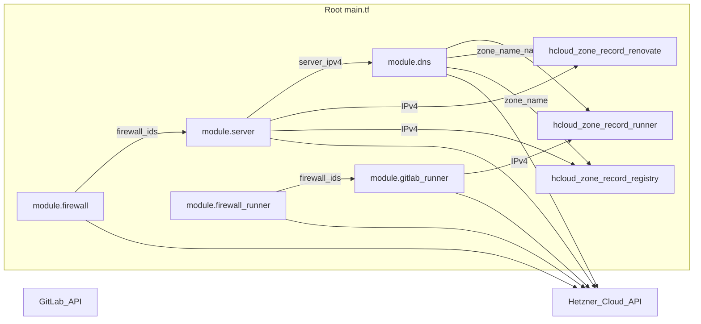

# gitlab-terraform-hcloud

Dieses Repository enthält Terraform-Code für **Hetzner Cloud**: einen Hauptserver mit Firewall, optionalem PTR und einer **Hetzner-DNS-Zone** inklusive Web- und Mail-Records. Über **`gitlab_install_mode`** steuerst du die **GitLab-Plattform**: aus (`none`), **Hetzner-App-Image** plus Omnibus-Cloud-Init (`hetzner_app`), **Debian-VM mit Docker Compose** auf Hetzner (`docker_compose`: GitLab CE, Traefik, PostgreSQL, **Container Registry**, optional **GitLab Runner** im Compose-Stack, optional **Mend Renovate CE**), oder **Proxmox QEMU-VMs** mit demselben Compose-Cloud-Init (`proxmox`). Optional eine **zweite VM als GitLab Runner** (`cpx22`) mit automatischer Installation der offiziellen GitLab-Runner-`.deb`-Pakete.

Unabhängig davon kann **`enable_gitlab_resources`** Gruppen und Projekte per **GitLab-API** in [`gitlab.tf`](terraform/gitlab.tf) anlegen (Provider [`gitlabhq/gitlab`](https://registry.terraform.io/providers/gitlabhq/gitlab/latest/docs)).

Provider: [`hetznercloud/hcloud`](https://registry.terraform.io/providers/hetznercloud/hcloud/latest/docs), [`hashicorp/random`](https://registry.terraform.io/providers/hashicorp/random/latest/docs), [`gitlabhq/gitlab`](https://registry.terraform.io/providers/gitlabhq/gitlab/latest/docs) (siehe [`terraform/provider.tf`](terraform/provider.tf)).

Ausführliche Dokumentation (Install-Modi, Proxmox, Variablenreferenz, Betrieb): **[`docs/README.md`](docs/README.md)**.

## Repository-Layout

| Pfad | Inhalt |
|------|--------|
| [`terraform/`](terraform/) | Terraform/OpenTofu: `*.tf`, [`modules/`](terraform/modules/), [`templates/`](terraform/templates/), `terraform.tfvars.example`, Lockfile, TFLint |
| [`docs/`](docs/) | Erweiterte Doku: [Inhaltsverzeichnis](docs/README.md), Install-Modi, Proxmox, Referenz, Betrieb |
| Root | Diese [`README.md`](README.md), [`CHANGELOG.md`](CHANGELOG.md), [`Makefile`](Makefile), [`.github/`](.github/), [`renovate.json`](renovate.json) |

Alle Befehle `terraform` / `tofu` und `terraform.tfvars` gehören in den Ordner **`terraform/`** (oder `make` vom Repo-Root aus).

**[Tech Stack](#tech-stack)** • **[Architektur](#architektur)** • **[Schnellstart](#schnellstart)** • **[Dokumentation](docs/README.md)** • **[Referenz](docs/reference.md)**

## Tech Stack

<table>
  <tr>
    <th>Logo</th>
    <th>Name</th>
    <th>Beschreibung</th>
  </tr>
  <tr>
    <td></td>
    <td><a href="https://developer.hashicorp.com/terraform">Terraform</a> / <a href="https://opentofu.org/">OpenTofu</a></td>
    <td>Infrastructure as Code für Hetzner Cloud (Server, Firewall, DNS, optional GitLab-API-Ressourcen). Konfiguration unter <a href="terraform/">terraform/</a>; siehe <a href="docs/operations.md#terraform-und-opentofu">Terraform und OpenTofu</a>.</td>
  </tr>
  <tr>
    <td></td>
    <td><a href="https://www.hetzner.com/cloud">Hetzner Cloud</a></td>
    <td>Cloud-Provider für VM, Firewall und SSH-Keys (<code>hcloud_token</code>). Standard-Stack: ein <code>cpx*</code>-Server in <code>fsn1</code> / <code>nbg1</code> / …</td>
  </tr>
  <tr>
    <td></td>
    <td><a href="https://dns.hetzner.com/">Hetzner DNS</a></td>
    <td>Authoritative DNS-Zone (<code>dns_domain</code>), A-Records für GitLab/Registry/Renovate/Runner und Mail-Records. Separates API-Token <code>hetzner_api_key</code> (nicht <code>hcloud_token</code>).</td>
  </tr>
  <tr>
    <td></td>
    <td><a href="https://about.gitlab.com/install/">GitLab CE</a></td>
    <td>CI/CD-Plattform: <code>hetzner_app</code> (Hetzner App-Image + Omnibus) oder <code>docker_compose</code> (<code>gitlab/gitlab-ce</code> im Compose-Stack). Siehe <a href="docs/gitlab-install-modes.md">GitLab-Installationsmodi</a>.</td>
  </tr>
  <tr>
    <td></td>
    <td><a href="https://docs.docker.com/compose/">Docker Compose</a></td>
    <td>Bei <code>gitlab_install_mode = docker_compose</code>: GitLab CE, Traefik, PostgreSQL, optional Runner, PlantUML und Renovate CE unter <code>/opt/gitlab</code> auf Debian (<code>gitlab_docker_host_image</code>).</td>
  </tr>
  <tr>
    <td></td>
    <td><a href="https://traefik.io/traefik">Traefik</a></td>
    <td>Reverse Proxy und TLS-Terminierung (HTTP/HTTPS, optional ACME DNS-01 über Hetzner). Image: <code>gitlab_docker_traefik_image</code> (Standard <code>traefik:v3.7.1</code>).</td>
  </tr>
  <tr>
    <td></td>
    <td><a href="https://www.postgresql.org/">PostgreSQL</a></td>
    <td>Externe Datenbank für GitLab im Compose-Modus (<code>postgres:16-alpine</code>, nur internes Netz <code>socket_proxy</code>).</td>
  </tr>
  <tr>
    <td></td>
    <td><a href="https://docs.gitlab.com/runner/">GitLab Runner</a></td>
    <td>Optional im Compose-Stack (<code>gitlab_docker_runner_enabled</code>, Autoregister per API) oder als eigene Hetzner-VM (<code>enable_gitlab_runner</code>, <code>.deb</code>-Installation). Siehe <a href="docs/gitlab-install-modes.md#gitlab-runner-im-compose-stack-autoregister">Autoregister</a>.</td>
  </tr>
  <tr>
    <td></td>
    <td><a href="https://www.debian.org/">Debian</a></td>
    <td>Standard-Host-OS für <code>docker_compose</code> (<code>debian-13</code>). Cloud-Init installiert Docker Engine und startet den Stack.</td>
  </tr>
  <tr>
    <td></td>
    <td><a href="https://www.proxmox.com/en/products/proxmox-virtual-environment/overview">Proxmox VE</a> <em>(optional)</em></td>
    <td>Alternative Zielplattform: QEMU-VMs + Cloud-Init-Snippet aus demselben Compose-Template (<code>proxmox.tf.example</code>, <code>enable_proxmox_resources</code>). Siehe <a href="docs/proxmox.md">GitLab auf Proxmox</a>.</td>
  </tr>
  <tr>
    <td></td>
    <td><a href="https://registry.terraform.io/providers/gitlabhq/gitlab/latest/docs">GitLab Terraform Provider</a></td>
    <td>Optionale API-Ressourcen (<code>enable_gitlab_resources</code>): Gruppe, Projekte, Bot-User, Renovate-Webhook in <a href="terraform/gitlab.tf">gitlab.tf</a> / Modul <a href="terraform/modules/gitlab-api/">gitlab-api</a>.</td>
  </tr>
  <tr>
    <td></td>
    <td><a href="https://docs.renovatebot.com/">Renovate</a></td>
    <td>Dependency-Updates: <a href="renovate.json">renovate.json</a> im Repo-Root (Mend GitHub App auf github.com); optional Mend Renovate CE im Compose-Stack (<code>gitlab_docker_renovate_enabled</code>).</td>
  </tr>
  <tr>
    <td></td>
    <td><a href="https://docs.github.com/en/actions">GitHub Actions</a> / <a href="https://docs.gitlab.com/ee/ci/">GitLab CI</a></td>
    <td>Qualitätssicherung: <code>fmt</code>, <code>validate</code>, TFLint (<a href=".github/workflows/terraform.yml">.github/workflows/terraform.yml</a>, <a href=".gitlab-ci.yml">.gitlab-ci.yml</a>, <code>make ci</code>).</td>
  </tr>
</table>


## Inhaltsverzeichnis

### In dieser README

- [Repository-Layout](#repository-layout)
- [Tech Stack](#tech-stack)
- [Architektur](#architektur)
- [Voraussetzungen](#voraussetzungen)
- [Schnellstart](#schnellstart)
- [Variablen & Outputs (Kurz)](#variablen--outputs-kurz)
- [GitLab (Überblick)](#gitlab-überblick)

### Dokumentation in `docs/`

Vollständiges [Inhaltsverzeichnis in `docs/README.md`](docs/README.md):

- [Variablen & Outputs](docs/reference.md) — alle Root-Variablen und Outputs
- [GitLab-Installationsmodi](docs/gitlab-install-modes.md) — `hetzner_app`, `docker_compose`, Registry, Renovate, Runner, API-Ressourcen
- [GitLab auf Proxmox](docs/proxmox.md) — Checkliste, VM-IDs, Troubleshooting
- [Betrieb, Module & CI](docs/operations.md) — Sicherheit, Cloud-Init, OpenTofu, `make ci`

## Architektur

Die Wurzelkonfiguration [`main.tf`](terraform/main.tf) bindet die Module **Firewall** → **Server** → **DNS** (A-Record für den Haupt-Host). Optional zusätzlich: **Firewall (Runner)** → **Server (Runner)** und eine **`hcloud_zone_record`** für den Runner in derselben DNS-Zone. Alle Ressourcen nutzen dieselbe Hetzner-Cloud-API.



Optional (nur bei `enable_gitlab_resources = true`): [`gitlab.tf`](terraform/gitlab.tf) nutzt die **GitLab-API** (`gitlab_group`, `gitlab_project`) — unabhängig von `gitlab_install_mode`.

| Modul / Ressource | Inhalt (Kurz) |
|--------|----------------|
| [`modules/firewall`](terraform/modules/firewall) | `hcloud_firewall`: eingehend u. a. SSH 22, **TCP 2424**, HTTP/HTTPS 80/443, DNS 53 (TCP/UDP), ICMP, Node Exporter; **ausgehend** DNS 53 (TCP/UDP), HTTP 80, HTTPS 443; bei **`gitlab_smtp_enabled`** zusätzlich SMTP (**TCP `gitlab_smtp_port`**, z. B. 587/465). |
| [`modules/server`](terraform/modules/server) | `hcloud_ssh_key`, `hcloud_server` (Image z. B. Ubuntu 24.04, `gitlab` bei `hetzner_app`, oder `gitlab_docker_host_image` bei `docker_compose`), Firewall-IDs, optional `hcloud_rdns`, optional `user_data` (Cloud-Init für GitLab oder Runner). |
| [`modules/dns`](terraform/modules/dns) | `hcloud_zone` (primary) und Records: Web-A-Record, Mail-A/AAAA/MX, Autoconfig/Autodiscover, DMARC/DKIM/SPF, CAA, TLSA, SRV. |
| [`modules/proxmox`](terraform/modules/proxmox) | `proxmox_vm_qemu` GitLab (+ optional Runner), Snippet-Upload für Docker-Compose-Cloud-Init (`cicustom`). Nur bei `enable_proxmox_resources`. |
| `module.firewall_runner` + `module.gitlab_runner` + `hcloud_zone_record.gitlab_runner` | Nur bei `enable_gitlab_runner = true`: Firewall (SSH/ICMP ein, Egress DNS/HTTP/HTTPS), **cpx22**-Server, A-Record **`<gitlab_runner_dns_label>.<zone>`**. |
| `hcloud_zone_record.renovate` | Nur bei `docker_compose` + **`gitlab_docker_renovate_enabled`**: A-Record **`<gitlab_docker_renovate_dns_label>.<zone>`** (Standard: `renovate.<zone>`) → gleiche Server-IPv4 wie GitLab. |
| `hcloud_zone_record.registry` | Nur bei `docker_compose` + **`gitlab_docker_registry_enabled`** (Standard `true`): A-Record **`<gitlab_docker_registry_dns_label>.<zone>`** (Standard: `registry.<zone>`) → gleiche Server-IPv4 wie GitLab. |

### Provider

In [`provider.tf`](terraform/provider.tf):

- **`hcloud`** (Standard) und **`hcloud.dns`** (Alias, gleiches Token): Server, Firewall, DNS (`providers = { hcloud.dns = hcloud.dns }` im DNS-Modul).
- **`gitlab`**: `token = var.gitlab_api_token`, `base_url = var.gitlab_api_url`. Wird nur für Ressourcen in [`gitlab.tf`](terraform/gitlab.tf) benötigt, wenn **`enable_gitlab_resources = true`**.
- **`proxmox`** ([`telmate/proxmox`](https://registry.terraform.io/providers/telmate/proxmox/latest/docs), `<=3.0.2-rc07`): optional in [`provider_proxmox.tf`](terraform/provider_proxmox.tf) (Vorlage [`provider_proxmox.tf.example`](terraform/provider_proxmox.tf.example)); VMs über [`module.proxmox`](terraform/modules/proxmox) bei **`enable_proxmox_resources = true`**.
- **`random`**: Passwörter für `docker_compose` (GitLab-`root`, PostgreSQL, optional Renovate-Webhook und Server-API-Secret).

## Voraussetzungen

- [Terraform](https://developer.hashicorp.com/terraform/install) **>= 1.14.4** (empfohlen; CI nutzt 1.14.4) **oder** [OpenTofu](https://opentofu.org/docs/intro/install/) **>= 1.9.0** (z. B. 1.12.x) — siehe [Terraform und OpenTofu](docs/operations.md#terraform-und-opentofu)
- Hetzner Cloud **API-Token** mit passenden Rechten (Server, Firewalls, SSH-Keys, DNS je nach Nutzung)
- Öffentlicher **SSH-Schlüssel** für den Root-Zugang auf dem Server
- Für DNS: Domain, die du in Hetzner DNS verwalten willst (Zonenname = Variable `dns_domain` bzw. dein Override)
- Für **`enable_gitlab_resources = true`**: GitLab-Instanz erreichbar unter **`gitlab_api_url`**, **Personal/Project Access Token** mit Rechten zum Anlegen von Gruppen und Projekten (`gitlab_api_token`)
- Für **`gitlab_docker_renovate_enabled = true`** (nur mit `gitlab_install_mode = docker_compose`): [Mend Renovate CE](https://www.mend.io/renovate-community/) **License Key**, GitLab-**PAT** für den Renovate-Bot (`gitlab_docker_renovate_gitlab_pat`, `api`-Scope auf deiner Instanz)
- Für **Proxmox** (optional): laufendes **Proxmox VE**, API-Token mit VM-Rechten, QEMU Guest Agent auf den VMs, Netzwerk-Bridge (z. B. `vmbr1`) — Details unter [GitLab auf Proxmox](docs/proxmox.md)

## Schnellstart

1. Repository klonen und ins Verzeichnis wechseln.
2. In **`terraform/`** wechseln und **`terraform.tfvars`** anlegen (wird per [`.gitignore`](.gitignore) ignoriert – keine Secrets committen):

   ```bash
   cd terraform
   cp terraform.tfvars.example terraform.tfvars
   ```

   Orientierung: [`terraform/terraform.tfvars.example`](terraform/terraform.tfvars.example). Mindestens die in der [Referenz](docs/reference.md#ohne-default-bei-apply-erforderlich) als **ohne Default** geführten Variablen setzen.

3. Module und Provider laden:

   ```bash
   terraform init
   ```

4. Plan und Apply:

   ```bash
   terraform plan
   terraform apply
   ```

Nach erfolgreichem Apply zeigen [`outputs.tf`](terraform/outputs.tf) u. a. öffentliche IPs, SSH-Befehl und DNS-Zoneninformationen an.

### Pre-commit (lokal)

Vor Commits optional [pre-commit](https://pre-commit.com/) installieren (spiegelt u. a. `terraform fmt`, `validate`, Modul-`terraform-docs`, YAML-Checks und **gitleaks**):

```bash
pip install pre-commit   # oder: brew install pre-commit
pre-commit install
pre-commit run -a        # einmalig alle Dateien prüfen
```

Konfiguration: [`.pre-commit-config.yaml`](.pre-commit-config.yaml). Modul-READMEs: [`terraform/.terraform-docs.yml`](terraform/.terraform-docs.yml) (inject-Mode). Vollständige CI-Checks weiterhin: `make ci`.

### Plan: GitLab-DNS oder Proxmox-401

| Fehler | Ursache | Maßnahme |
|--------|---------|----------|
| `lookup gitlab.cicd-showcase.de: no such host` | Terraform **refresht** GitLab-API-Ressourcen im State, bevor Server/DNS existieren | **Erst Apply** für Server + DNS (`enable_gitlab_resources = false`), danach `true`; oder `make plan-no-refresh` / `terraform plan -refresh=false`; bei totem Alt-State: `terraform state rm` für `gitlab_*` / `module.gitlab_api` |
| `401` / `connection refused` (Proxmox) | `proxmox.tf` / `provider_proxmox.tf` vorhanden, obwohl Proxmox aus ist | Dateien löschen/umbenennen; Hetzner-only: `enable_proxmox_resources = false` und keine kopierten `proxmox*.tf` |
| `Attribute redefined` (`proxmox_api_token`) | Token zweimal in `terraform.tfvars` | Nur eine Zeile; `proxmox_api_token_id` ist **nicht** das Secret |
| Proxmox 401 bei `enable_proxmox_resources = true` | Token/ID falsch | `proxmox_api_token` + `proxmox_api_token_id` in `terraform.tfvars` prüfen |

Empfohlene **Zwei-Phasen-Bootstrap** für neues Hetzner-`docker_compose`:

1. `enable_gitlab_resources = false` → `terraform apply` (Server, DNS, Compose)
2. Warten bis `https://gitlab.<zone>` erreichbar → `enable_gitlab_resources = true` → erneut `apply`

**GitLab Runner im Compose-Stack:** Mit **`gitlab_docker_runner_autoregister = true`** (Standard) und leerem **`gitlab_docker_runner_token`** läuft die Registrierung per Bootstrap-Skript automatisch nach GitLab-Start — kein manuelles `glrt-…` nötig (siehe [GitLab Runner im Compose-Stack (Autoregister)](docs/gitlab-install-modes.md#gitlab-runner-im-compose-stack-autoregister)).

## Variablen & Outputs (Kurz)

| Name | Rolle |
|------|--------|
| `hcloud_token` | Hetzner Cloud API (Pflicht) |
| `hetzner_api_key` | Hetzner DNS API (Pflicht; nicht `hcloud_token`) |
| `ssh_public_key` / `ssh_public_key_file` | SSH für Server (Pflicht) |
| `dns_domain` | DNS-Zone und GitLab-FQDN-Basis |
| `gitlab_install_mode` | `none` \| `hetzner_app` \| `docker_compose` \| `proxmox` |
| `enable_gitlab_resources` | GitLab-API: Gruppen/Projekte per Terraform |
| `enable_proxmox_resources` | Proxmox-VMs (mit kopierten `proxmox*.tf`) |

**Vollständige Tabellen** aller Variablen (mit Defaults) und Outputs: **[`docs/reference.md`](docs/reference.md)**.

## GitLab (Überblick)

| Modus | Ziel | Doku |
|-------|------|------|
| `none` | Nur Hetzner-Infrastruktur (kein GitLab auf dem Hauptserver) | — |
| `hetzner_app` | Hetzner App-Image `gitlab` + Omnibus-Cloud-Init | [`docs/gitlab-install-modes.md`](docs/gitlab-install-modes.md#hetzner_app-hetzner-app-image) |
| `docker_compose` | Debian-VM, Docker Compose unter `/opt/gitlab` (Traefik, CE, PostgreSQL, optional Registry/Renovate/Runner) | [`docs/gitlab-install-modes.md`](docs/gitlab-install-modes.md#docker_compose-gitlab-ce--traefik) |
| `proxmox` | QEMU-VM in Proxmox VE, gleiches Compose-Cloud-Init per Snippet | [`docs/proxmox.md`](docs/proxmox.md) |

Zusätzlich optional: **`enable_gitlab_resources`** ([`gitlab.tf`](terraform/gitlab.tf)), **`enable_gitlab_runner`** (eigene Hetzner-Runner-VM), Betrieb und CI — siehe [`docs/README.md`](docs/README.md).
