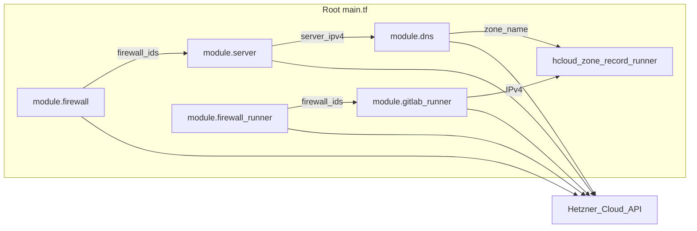
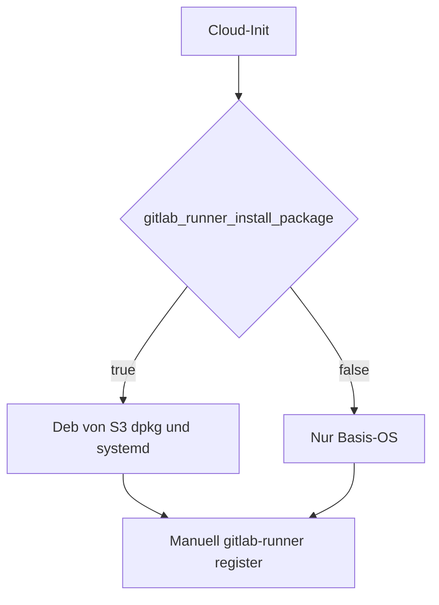

# gitlab-terraform-hcloud

Dieses Repository enthält Terraform-Code für **Hetzner Cloud**: einen Hauptserver mit Firewall, optionalem PTR und einer **Hetzner-DNS-Zone** inklusive Web- und Mail-Records. Über **`gitlab_install_mode`** steuerst du GitLab: aus (`none`), **Hetzner-App-Image** plus Omnibus-Cloud-Init (`hetzner_app`), oder **Debian-VM mit Docker Compose** (GitLab CE + Traefik, `docker_compose`). Optional eine **zweite VM als GitLab Runner** (`cpx22`) mit automatischer Installation der offiziellen GitLab-Runner-`.deb`-Pakete.

Provider: [`hetznercloud/hcloud`](https://registry.terraform.io/providers/hetznercloud/hcloud/latest/docs) (siehe [`provider.tf`](provider.tf)).

## Inhaltsverzeichnis

- [Architektur](#architektur)
  - [Zwei `hcloud`-Provider](#zwei-hcloud-provider)
- [Voraussetzungen](#voraussetzungen)
- [Schnellstart](#schnellstart)
- [Variablen (Root)](#variablen-root)
  - [Ohne Default (bei `apply` erforderlich)](#ohne-default-bei-apply-erforderlich)
  - [Mit Default (optional überschreibbar)](#mit-default-optional-überschreibbar)
- [Outputs](#outputs)
- [GitLab-Installationsmodi](#gitlab-installationsmodi)
- [GitLab Runner (optionale zweite VM)](#gitlab-runner-optionale-zweite-vm)
- [Module im Detail](#module-im-detail)
- [Sicherheit und Betrieb](#sicherheit-und-betrieb)
- [Cloud-Init und user_data](#cloud-init-und-user_data)
- [Qualitätssicherung (lokal / CI)](#qualitätssicherung-lokal--ci)
- [Bekannte Einschränkungen](#bekannte-einschränkungen)
- [Weiterführende Links](#weiterführende-links)

## Architektur

Die Wurzelkonfiguration [`main.tf`](main.tf) bindet die Module **Firewall** → **Server** → **DNS** (A-Record für den Haupt-Host). Optional zusätzlich: **Firewall (Runner)** → **Server (Runner)** und eine **`hcloud_zone_record`** für den Runner in derselben DNS-Zone. Alle Ressourcen nutzen dieselbe Hetzner-Cloud-API.



| Modul / Ressource | Inhalt (Kurz) |
|--------|----------------|
| [`modules/firewall`](modules/firewall) | `hcloud_firewall`: u. a. SSH 22, HTTP 80, HTTPS 443, DNS 53 (TCP/UDP), optional Node Exporter, ICMP; Quell-IPs standardmäßig weltweit konfigurierbar. |
| [`modules/server`](modules/server) | `hcloud_ssh_key`, `hcloud_server` (Image z. B. Ubuntu 24.04, `gitlab` bei `hetzner_app`, oder `gitlab_docker_host_image` bei `docker_compose` im Root), Firewall-IDs, optional `hcloud_rdns`, optional `user_data` (Cloud-Init für GitLab oder Runner). |
| [`modules/dns`](modules/dns) | `hcloud_zone` (primary) und Records: Web-A-Record, Mail-A/AAAA/MX, Autoconfig/Autodiscover, DMARC/DKIM/SPF, CAA, TLSA, SRV. |
| `module.firewall_runner` + `module.gitlab_runner` + `hcloud_zone_record.gitlab_runner` | Nur bei `enable_gitlab_runner = true`: minimale Firewall (SSH, ICMP), **cpx22**-Server, A-Record **`<gitlab_runner_dns_label>.<zone>`** (Standard: `runner05.<zone>`). |

### Zwei `hcloud`-Provider

In [`provider.tf`](provider.tf) gibt es den Standard-Provider `hcloud` und einen zweiten Block mit **`alias = "dns"`** (gleiches Token). Das DNS-Modul setzt `providers = { hcloud.dns = hcloud.dns }`, damit DNS-Ressourcen explizit über diesen Alias laufen (u. a. für klare Zuordnung und State-Kompatibilität).

## Voraussetzungen

- [Terraform](https://developer.hashicorp.com/terraform/install) **>= 1.14.4** (siehe `terraform`-Block in [`provider.tf`](provider.tf))
- Hetzner Cloud **API-Token** mit passenden Rechten (Server, Firewalls, SSH-Keys, DNS je nach Nutzung)
- Öffentlicher **SSH-Schlüssel** für den Root-Zugang auf dem Server
- Für DNS: Domain, die du in Hetzner DNS verwalten willst (Zonenname = Variable `domain_cicd_showcase_de` bzw. dein Override)

## Schnellstart

1. Repository klonen und ins Verzeichnis wechseln.
2. **`terraform.tfvars`** anlegen (wird per [`.gitignore`](.gitignore) ignoriert – keine Secrets committen). Orientierung: [`terraform.tfvars.example`](terraform.tfvars.example). Mindestens die in der Tabelle unten als **ohne Default** geführten Variablen setzen.
3. Module und Provider laden:

   ```bash
   terraform init
   ```

4. Plan und Apply:

   ```bash
   terraform plan
   terraform apply
   ```

Nach erfolgreichem Apply zeigen [`outputs.tf`](outputs.tf) u. a. öffentliche IPs, SSH-Befehl und DNS-Zoneninformationen an.

## Variablen (Root)

Terraform verlangt **alle Variablen ohne `default`**, auch wenn `main.tf` sie derzeit nicht nutzt (siehe Abschnitt [Bekannte Einschränkungen](#bekannte-einschränkungen)).

### Ohne Default (bei `apply` erforderlich)

| Name | Typ | Sensitiv | Beschreibung |
|------|-----|----------|--------------|
| `hcloud_token` | string | ja | Hetzner Cloud API-Token |
| `ssh_public_key` | string | nein | Eine Zeile aus `*.pub`, **oder** leer lassen und `ssh_public_key_file` setzen |
| `hetzner_api_key` | string | ja | In `variables.tf` für Traefik/DNS bei ACME beschrieben; **Root-`main.tf` übergibt sie aktuell an kein Modul** |
| `traefik_dashboard_credentials` | string | ja | BasicAuth-artig `user:…`; **ebenfalls nicht an Module gebunden** |

### Mit Default (optional überschreibbar)

| Name | Default (Kurz) | Hinweis |
|------|------------------|---------|
| `ssh_private_key_path` | `~/.ssh/id_rsa` | Nur relevant, falls du Skripte/Tooling außerhalb dieses Roots nutzt – **nicht** von `main.tf` referenziert |
| `server_name` | `web1` | Name des `hcloud_server` |
| `server_type` | `cx23` | Hetzner-Typ (`cx*`, `cpx*`, `ccx*`) |
| `location` | `fsn1` | z. B. `fsn1`, `nbg1`, `hel1`, `ash`, `hil` |
| `gitlab_install_mode` | `none` | `none`: kein GitLab; `hetzner_app`: Image `gitlab` + [`templates/gitlab-cloud-init.yaml.tpl`](templates/gitlab-cloud-init.yaml.tpl); `docker_compose`: `gitlab_docker_host_image` (Standard `debian-13`) + [`templates/gitlab-docker-cloud-init.yaml.tpl`](templates/gitlab-docker-cloud-init.yaml.tpl), Stack unter `/opt/gitlab` |
| `gitlab_docker_host_image` | `debian-13` | Nur `docker_compose`: Hetzner-Image-Slug für den Hauptserver (vor Apply mit `hcloud image list` prüfen; bei abweichendem Slug z. B. `debian-12` setzen) |
| `gitlab_docker_traefik_image` | `traefik:v3.7.1` | Traefik-Container in `docker_compose` |
| `gitlab_docker_gitlab_ce_image` | `gitlab/gitlab-ce:18.10.5-ce.0` | GitLab-CE-Image-Tag in `docker_compose` |
| `gitlab_docker_postgres_image` | `postgres:16-alpine` | PostgreSQL-Container-Image (Version wie bei Traefik pinnen, z. B. `postgres:17`) |
| `gitlab_docker_traefik_acme_enabled` | `false` | `true`: Traefik Let’s Encrypt (HTTP-01); nur bei `gitlab_install_mode = docker_compose`; ACME-Mail wie Omnibus über `gitlab_letsencrypt_email` bzw. Fallback `gitlab-acme@<zone>` |
| `server_image` | `ubuntu-24.04` | Nur bei `gitlab_install_mode = none` (Hetzner-Image-Slug) |
| `gitlab_dns_record_name` | `gitlab` | Relativer A-Record bei GitLab: FQDN = `<name>.<zone>` |
| `gitlab_letsencrypt_email` | leer | ACME-Kontakt; leer → `gitlab-acme@<zone>` (nur relevant, wenn LE aktiv) |
| `gitlab_letsencrypt_enabled` | `false` | Nur **`hetzner_app`**: `https` + integriertes LE (HTTP-01). Bei `docker_compose` **`gitlab_docker_traefik_acme_enabled`** verwenden. |
| `gitlab_bootstrap_wait_seconds` | `120` | Wartezeit im **per-instance**-Skript vor `gitlab-ctl reconfigure` (DNS) |
| `enable_gitlab_runner` | `false` | `true`: zweite VM (**cpx22**), Runner-Firewall, A-Record + PTR auf `<gitlab_runner_dns_label>.<zone>` |
| `gitlab_runner_install_package` | `true` | Bei aktivem Runner: Cloud-Init installiert **.deb**-Pakete von GitLab S3 (siehe [manuelle Installation](https://docs.gitlab.com/runner/install/linux-manually/)), Log `/var/log/gitlab-runner-terraform-bootstrap.log`; `false`: nur Ubuntu |
| `gitlab_runner_server_name` | `runner05` | Name des `hcloud_server` für den Runner |
| `gitlab_runner_dns_label` | `runner05` | Relativer A-Record-Name; FQDN = `<label>.<domain_cicd_showcase_de>` (z. B. `runner05.cicd-showcase.de`; ursprünglich oft als Platzhalter `runner05.example.com` gedacht) |
| `gitlab_runner_image` | `ubuntu-24.04` | Hetzner-Image-Slug für die Runner-VM |
| `gitlab_runner_location` | `""` | Leer = gleiche Region wie `location`; sonst z. B. `fsn1`, `nbg1`, … |
| `create_hcloud_dns_zone` | `true` | `false`, wenn die Zone in Hetzner DNS schon existiert (vermeidet 409 *Zone already exists*) |
| `ssh_public_key_file` | `""` | Optional: Pfad zur `.pub`-Datei (z. B. `~/.ssh/id_ed25519.pub`), überschreibt `ssh_public_key` |
| `github_repo` | HTTPS-URL | **Nicht** in Root-`main.tf` verwendet; gedacht für Cloud-Init/Beispiele (s. Modul-README) |
| `site_url` | `https://cicd-showcase.de` | Wird als Output `website_url` ausgegeben |
| `domain_cicd_showcase_de` | `cicd-showcase.de` | DNS-Zonenname; bei GitLab auch Basis für `gitlab_fqdn` und PTR |
| `mail_server_ipv4` | IPv4 | Mail-**A**-Record (`module.dns`) |
| `mail_server_ipv6` | IPv6 | Mail-**AAAA**-Record |
| `mail_server_cname_target` | Hostname | CNAME-Ziel Autoconfig/Autodiscover |
| `dns_tlsa_name` | TLSA-Name | z. B. `_25._tcp.mail.example.com` |
| `mail_mx_value` | Priorität + Mail-Host | MX-Record in der Zone |
| `dmarc_value` | DMARC-String | muss `v=DMARC1` enthalten |
| `dkim_value` | DKIM-String | Lange Werte werden im DNS-Modul in Chunks aufgeteilt |
| `spf_value` | SPF-String | muss `v=spf1` enthalten |
| `tlsa_value` | TLSA-Felder | Für den TLSA-Record im Modul |
| `srv_value` | SRV-Ziel | Ziel-Hostnamen mit **trailing dot** |
| `iodef_value` / `contact_value` | `mailto:…` | CAA iodef/contact |

[`main.tf`](main.tf) übergibt an `module.dns` u. a. **`mail_server_ipv4`**, **`mail_server_ipv6`**, **`mail_server_cname_target`**, **`dns_tlsa_name`** (Defaults in [`variables.tf`](variables.tf)). **`spf_value`** ist separat; bei `ip4:` in SPF zur Mail-A-Record-IP passend halten.

## Outputs

| Output | Bedeutung |
|--------|-----------|
| `server_ip` | Öffentliche IPv4 des Servers |
| `server_ipv6` | Öffentliche IPv6 |
| `server_name` | Servername |
| `server_id` | Hetzner-Server-ID |
| `server_status` | Status des Servers |
| `firewall_id` / `firewall_name` | Firewall in Hetzner Cloud |
| `ssh_connection` | Vorschlag: `ssh root@<ipv4>` |
| `dns_zone_id` / `dns_zone_name` | DNS-Zone |
| `website_url` | Wert von `var.site_url` |
| `domain_cicd_showcase_de` | Entspricht dem Zonennamen aus dem DNS-Modul |
| `gitlab_url` | Bei aktivem GitLab-Modus: `http://…` oder `https://…` (Omnibus: `gitlab_letsencrypt_enabled`; Docker: `gitlab_docker_traefik_acme_enabled`), sonst `null` |
| `gitlab_fqdn` | FQDN des GitLab-A-Records oder `null` |
| `gitlab_docker_initial_root_password` | Nur `docker_compose`: initiales `root`-Passwort (sensitiv; liegt im **Terraform State**) |
| `gitlab_docker_postgres_password` | Nur `docker_compose`: Passwort des DB-Users `gitlab` (sensitiv; State + `user_data`) |
| `gitlab_runner_ipv4` | Öffentliche IPv4 der Runner-VM oder `null` |
| `gitlab_runner_fqdn` | FQDN des Runner-A-Records oder `null` |
| `gitlab_runner_ssh_connection` | `ssh root@<runner_ipv4>` oder `null` |
| `gitlab_runner_firewall_id` | ID der Runner-Firewall oder `null` |

## GitLab-Installationsmodi

Steuerung über **`gitlab_install_mode`**: `none` | `hetzner_app` | `docker_compose` (Default: `none`).

**Migration** von der früheren Variable `enable_gitlab_app`: `enable_gitlab_app = true` → `gitlab_install_mode = "hetzner_app"`; `false` → `"none"`.

### `hetzner_app` (Hetzner App-Image)

Wenn `gitlab_install_mode = "hetzner_app"`:

- Server-Image: **`gitlab`** (vgl. [hetznercloud/apps – GitLab](https://github.com/hetznercloud/apps/tree/main/apps/hetzner/gitlab)).
- Automatisierung: **systemd-Oneshot** `gitlab-terraform-bootstrap.service` + Hintergrund-**Scheduler** `/usr/local/sbin/gitlab-terraform-schedule-bootstrap.sh` (wartet bis `gitlab_setup` in `/root/.bashrc` sichtbar ist oder Timeout, dann `systemctl start`), damit der Dienst auch startet, wenn `enable` bei bereits aktivem `multi-user` nicht ausreicht. Zusätzlich wird **`/opt/hcloud/gitlab_setup.sh`** durch ein No-Op-Skript ersetzt (Fallback, falls noch ein Aufruf in der Shell-RC bleibt).
- DNS: A-Record **`gitlab_dns_record_name`** (Standard `gitlab`) → Server-IPv4; PTR (IPv4/IPv6) auf dieselbe FQDN, damit Zertifikatsprüfungen konsistent bleiben.
- **Let’s Encrypt:** Mit `gitlab_letsencrypt_enabled = false` (Standard) setzt Cloud-Init `external_url` auf **http**, schreibt **`letsencrypt['enable'] = false`** und **`letsencrypt['auto_enabled'] = false`**, setzt **`nginx['listen_https'] = false`**, und setzt in **`/etc/gitlab/gitlab-secrets.json`** ebenfalls **`letsencrypt.auto_enabled`** auf **`false`**. Grund: Omnibus kann LE sonst über die Auto-Enable-Heuristik und den in den Secrets persistierten `auto_enabled`-Schalter wieder aktivieren (siehe [MR !2353](https://gitlab.com/gitlab-org/omnibus-gitlab/-/merge_requests/2353)), selbst wenn zuvor schon Zeilen in `gitlab.rb` angepasst wurden.
- **Bootstrap erneut:** War früher `ExecStartPost` mit `touch` aktiv, kann **`/var/lib/gitlab-terraform/.bootstrap-done`** trotz fehlgeschlagenem `reconfigure` existieren — entfernen und `systemctl start gitlab-terraform-bootstrap.service` erneut ausführen (oder Server mit neuem `user_data` ersetzen). Aktuelles Template setzt `.bootstrap-done` **nur nach erfolgreichem** `gitlab-ctl reconfigure`.

Offizielle App-Doku: [Hetzner Cloud Apps – GitLab CE](https://docs.hetzner.com/cloud/apps/list/gitlab-ce/).

### `docker_compose` (GitLab CE + Traefik)

Wenn `gitlab_install_mode = "docker_compose"`:

- Server-Image: **`gitlab_docker_host_image`** (Standard **`debian-13`**). Vor Produktion den Slug mit `hcloud image list` / Konsole prüfen.
- Cloud-Init ([`templates/gitlab-docker-cloud-init.yaml.tpl`](templates/gitlab-docker-cloud-init.yaml.tpl)): Docker Engine + Compose-Plugin (offizielles Docker-APT-Repo), **`write_files`** für **`/opt/gitlab/docker-compose.yml`**, **`/opt/gitlab/traefik/traefik.yml`**, **`/opt/gitlab/traefik/.env`** (optional Overrides), **`/opt/gitlab/traefik/dynamic_conf/`** (File-Provider), **`runcmd`**: `docker compose up -d`; Log **`/var/log/gitlab-docker-bootstrap.log`**.
- Stack: **Traefik**-Service orientiert an LAB-`compose/traefik.yaml` (pi3cl: `container_name`, `env_file`, `hostname`, `healthcheck` mit `--ping`, feste IPv4/IPv6 auf **crowdsec** / **proxy** / **socket_proxy**, `security_opt`, Ports **80/443** und **8080** für Ping/API-Entrypoint, Volumes u. a. `localtime`, Einzeldatei-Mount für `traefik.yml`, `dynamic_conf`, ACME-Volume, Log-Volume). Image weiterhin über Terraform-Variable **`gitlab_docker_traefik_image`**. Keine LAB-spezifischen Secrets, Homelab-Host-Pfade oder Authentik-Labels. **GitLab CE** (`gitlab_docker_gitlab_ce_image`) und **PostgreSQL** (`gitlab_docker_postgres_image`); GitLab nutzt die externe DB (`postgresql['enable'] = false`), Redis bleibt im GitLab-Container. **Docker-Netze** analog LAB `networks.yaml` (crowdsec, **proxy**, socket_proxy): GitLab und Postgres nur auf **`proxy`**; Traefik zusätzlich auf **crowdsec** und **socket_proxy** mit den LAB-typischen statischen Adressen. Namen und Subnetze per Compose `${NETWORKS_*:-…}` überschreibbar (z. B. `/opt/gitlab/.env`). Traefik-Label `traefik.docker.network` nutzt dieselbe Substitution wie der `proxy`-Netzname. Router per Host-Regel auf `gitlab_fqdn`.
- TLS: **`gitlab_docker_traefik_acme_enabled`** schaltet ACME auf Traefik; **`gitlab_letsencrypt_enabled`** gilt nur für Omnibus (`hetzner_app`).
- Initiales **`root`**: [`random_password`](https://registry.terraform.io/providers/hashicorp/random/latest/docs/resources/password) in Terraform; Output **`gitlab_docker_initial_root_password`** (sensitiv) — **Passwort steht im State**, nach erstem Login rotieren.
- **PostgreSQL-App-Passwort:** ebenfalls `random_password`, Output **`gitlab_docker_postgres_password`** (sensitiv; State und `user_data`).
- DNS/PTR: wie bei `hetzner_app` (A-Record `gitlab_dns_record_name`, PTR auf `gitlab_fqdn`).

## GitLab Runner (optionale zweite VM)

Wenn `enable_gitlab_runner = true`:

- **Server:** Zweites [`modules/server`](modules/server) mit festem Typ **`cpx22`**, Image `gitlab_runner_image` (Standard Ubuntu 24.04), Region `gitlab_runner_location` oder wie `location`.
- **Firewall:** [`module.firewall_runner`](modules/firewall) mit nur **SSH (22)** und **ICMP**; kein HTTP/HTTPS/DNS/Node-Exporter nach außen (Runner zieht Jobs typischerweise **ausgehend** zu GitLab).
- **DNS:** [`hcloud_zone_record.gitlab_runner`](main.tf) in derselben Zone wie `domain_cicd_showcase_de`; PTR zeigt auf **`gitlab_runner_fqdn`** (Standard `runner05.<zone>`).
- **Paket-Install:** `gitlab_runner_install_package` steuert Cloud-Init ([`templates/gitlab-runner-cloud-init.yaml.tpl`](templates/gitlab-runner-cloud-init.yaml.tpl)): bei `true` [manuelle .deb-Installation](https://docs.gitlab.com/runner/install/linux-manually/) inkl. Arch-Mapping (`armhf`→`arm`), `dpkg`/`apt-get install -f`, `systemctl enable --now gitlab-runner`; bei `false` bleibt die VM ohne Runner-Paket.
- **Registrierung:** Kein `gitlab-runner register` in Terraform (Token würde im State landen). Nach dem Apply per SSH auf die Runner-VM verbinden und [Runner registrieren](https://docs.gitlab.com/runner/register/) (URL z. B. `terraform output -raw gitlab_url`, Token aus GitLab UI / CI-Variable).



## Module im Detail

- **Firewall** ([`modules/firewall`](modules/firewall)): Regeln per Variablen im Modul schaltbar; für Restriktionen z. B. `ssh_source_ips` im Modulaufruf erweitern (aktuell nutzt der Root nur `firewall_name`).
- **Server** ([`modules/server`](modules/server)): Vollständigere Modul-Doku in [`modules/server/README.md`](modules/server/README.md). Im **Root** setzt Cloud-Init **`user_data`** bei `gitlab_install_mode` `hetzner_app` oder `docker_compose` (jeweils eigenes Template), sonst leer.
- **DNS** ([`modules/dns`](modules/dns)): Zone + Records; DKIM-Längen >255 werden automatisch gesplittet.

## Sicherheit und Betrieb

- **Firewall:** Standard im Modul erlaubt typischerweise Zugriff von `0.0.0.0/0` und `::/0` auf die genannten Ports. Für Produktion Quell-IP-Listen einschränken oder `custom_rules` gezielt nutzen.
- **Token:** `hcloud_token` und andere Secrets nur in `terraform.tfvars` oder CI-Secrets; nicht versionieren.
- **PTR/rDNS:** Wenn `gitlab_install_mode` **nicht** `none`, zeigt PTR auf die GitLab-FQDN, sonst auf `domain_cicd_showcase_de`. Bei HTTPS (Omnibus-LE oder Traefik-ACME) sollte der Hostname zum Zertifikat passen.
- **Mail/DNS:** Über die Variablen **`mail_server_ipv4`**, **`mail_server_ipv6`**, **`mail_server_cname_target`**, **`dns_tlsa_name`** (und bestehende MX/SPF/DMARC/…) an die eigene Infrastruktur anpassen.

## Cloud-Init und user_data

Hetzner wendet **`user_data` (Cloud-Init) in der Regel nur beim ersten Boot** einer neuen Server-Instanz an. Änderungen an [`templates/gitlab-cloud-init.yaml.tpl`](templates/gitlab-cloud-init.yaml.tpl), [`templates/gitlab-docker-cloud-init.yaml.tpl`](templates/gitlab-docker-cloud-init.yaml.tpl) oder [`templates/gitlab-runner-cloud-init.yaml.tpl`](templates/gitlab-runner-cloud-init.yaml.tpl) wirken auf **bestehende** VMs oft **erst**, wenn die Instanz **ersetzt** wird.

Vorgehen (Beispiel Runner):

```bash
terraform apply -replace='module.gitlab_runner[0].hcloud_server.main'
```

Entsprechend für den Hauptserver `module.server.hcloud_server.main`, falls dort `user_data` geändert wurde. **Hinweis:** Replace löscht die Root-Disk der VM (keine Daten auf zusätzlichen Volumes, sofern nicht separat angebunden).

**Troubleshooting:** `sudo tail -n 200 /var/log/cloud-init-output.log` auf der VM; Runner zusätzlich `/var/log/gitlab-runner-terraform-bootstrap.log`. Typischer Fehler: falsche **.deb-URL** (z. B. Bindestrich statt Unterstrich im Dateinamen) → `curl` **403**.

## Qualitätssicherung (lokal / CI)

- **Makefile:** `make fmt` formatiert, `make validate` prüft Format (`fmt -check`) und führt `terraform validate` aus (nach `terraform init` im Repo).
- **GitHub Actions:** [`.github/workflows/terraform.yml`](.github/workflows/terraform.yml) – bei Push/PR: `terraform fmt -check`, `init -backend=false`, `validate` (ohne Cloud-Token für `apply`).

## Bekannte Einschränkungen

1. **Variablen ohne Modul-Anbindung im Root:** `github_repo`, `hetzner_api_key`, `traefik_dashboard_credentials` und `ssh_private_key_path` werden in **`main.tf` nicht** an Module übergeben. `site_url` wird nur für den Output `website_url` gelesen, ebenfalls ohne Modulbezug. `terraform apply` verlangt dennoch Werte für alle Variablen **ohne** Default (`hetzner_api_key`, `traefik_dashboard_credentials`). Du kannst Platzhalter setzen, bis Cloud-Init o. Ä. angebunden ist – oder die Variablen später in Terraform bereinigen.
2. **DNS-A-Record vs. `server_name`:** Der relative A-Record-Name kommt aus `dns_ipv4_record_name` bzw. bei GitLab aus `gitlab_dns_record_name` – nicht automatisch aus `server_name`. Bei Bedarf Werte angleichen.
3. **Beispiel-Konfiguration:** [`terraform.tfvars.example`](terraform.tfvars.example) als Vorlage für `terraform.tfvars` (ohne echte Secrets).

## Weiterführende Links

- [Hetzner Cloud Terraform Provider (Registry)](https://registry.terraform.io/providers/hetznercloud/hcloud/latest/docs)
- [Hetzner Dokumentation](https://docs.hetzner.com/)
