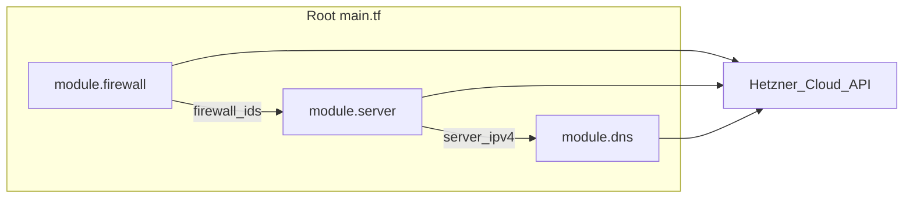

# gitlab-terraform-hcloud

Terraform-Konfiguration für **Hetzner Cloud**: ein Ubuntu-Server mit Firewall, optionalem Reverse-DNS (PTR) und einer **Hetzner-DNS-Primärzone** inklusive Web- und Mail-bezogener Records (SPF, DKIM, DMARC, CAA, TLSA, SRV usw.).

Provider: [`hetznercloud/hcloud`](https://registry.terraform.io/providers/hetznercloud/hcloud/latest/docs) (siehe [`provider.tf`](provider.tf)).

## Architektur

Die Wurzelkonfiguration [`main.tf`](main.tf) bindet drei lokale Module: **Firewall** → **Server** (Firewall wird angehängt) → **DNS** (A-Record für den Web-Host zeigt auf die IPv4 des Servers). Alle Ressourcen sprechen dieselbe Hetzner-Cloud-API an.



| Modul | Inhalt (Kurz) |
|--------|----------------|
| [`modules/firewall`](modules/firewall) | `hcloud_firewall`: u. a. SSH 22, HTTP 80, HTTPS 443, DNS 53 (TCP/UDP), optional Node Exporter, ICMP; Quell-IPs standardmäßig weltweit konfigurierbar. |
| [`modules/server`](modules/server) | `hcloud_ssh_key`, `hcloud_server` (Image z. B. Ubuntu 24.04 im Root gesetzt), Firewall-IDs, optional `hcloud_rdns` für IPv4/IPv6. |
| [`modules/dns`](modules/dns) | `hcloud_zone` (primary) und Records: Web-A-Record, Mail-A/AAAA/MX, Autoconfig/Autodiscover, DMARC/DKIM/SPF, CAA, TLSA, SRV. |

### Zwei `hcloud`-Provider

In [`provider.tf`](provider.tf) gibt es den Standard-Provider `hcloud` und einen zweiten Block mit **`alias = "dns"`** (gleiches Token). Das DNS-Modul setzt `providers = { hcloud.dns = hcloud.dns }`, damit DNS-Ressourcen explizit über diesen Alias laufen (u. a. für klare Zuordnung und State-Kompatibilität).

## Voraussetzungen

- [Terraform](https://developer.hashicorp.com/terraform/install) **>= 1.14.4** (siehe `terraform`-Block in [`provider.tf`](provider.tf))
- Hetzner Cloud **API-Token** mit passenden Rechten (Server, Firewalls, SSH-Keys, DNS je nach Nutzung)
- Öffentlicher **SSH-Schlüssel** für den Root-Zugang auf dem Server
- Für DNS: Domain, die du in Hetzner DNS verwalten willst (Zonenname = Variable `domain_cicd_showcase_de` bzw. dein Override)

## Schnellstart

1. Repository klonen und ins Verzeichnis wechseln.
2. **`terraform.tfvars`** anlegen (wird per [`.gitignore`](.gitignore) ignoriert – keine Secrets committen). Mindestens die in der Tabelle unten als **ohne Default** geführten Variablen setzen.
3. Module und Provider laden:

   ```bash
   terraform init
   ```

4. Plan und Apply:

   ```bash
   terraform plan
   terraform apply
   ```

Nach erfolgreichem Apply zeigen [`outputs.tf`](outputs.tf) u. a. öffentliche IPs, SSH-Befehl und DNS-Zoneninformationen an.

## Variablen (Root)

Terraform verlangt **alle Variablen ohne `default`**, auch wenn `main.tf` sie derzeit nicht nutzt (siehe Abschnitt [Bekannte Einschränkungen](#bekannte-einschränkungen)).

### Ohne Default (bei `apply` erforderlich)

| Name | Typ | Sensitiv | Beschreibung |
|------|-----|----------|--------------|
| `hcloud_token` | string | ja | Hetzner Cloud API-Token |
| `ssh_public_key` | string | nein | Öffentlicher SSH-Key (Format wird validiert) |
| `hetzner_api_key` | string | ja | In `variables.tf` für Traefik/DNS bei ACME beschrieben; **Root-`main.tf` übergibt sie aktuell an kein Modul** |
| `traefik_dashboard_credentials` | string | ja | BasicAuth-artig `user:…`; **ebenfalls nicht an Module gebunden** |

### Mit Default (optional überschreibbar)

| Name | Default (Kurz) | Hinweis |
|------|------------------|---------|
| `ssh_private_key_path` | `~/.ssh/id_rsa` | Nur relevant, falls du Skripte/Tooling außerhalb dieses Roots nutzt – **nicht** von `main.tf` referenziert |
| `server_name` | `web1` | Name des `hcloud_server` |
| `server_type` | `cx23` | Hetzner-Typ (`cx*`, `cpx*`, `ccx*`) |
| `location` | `fsn1` | z. B. `fsn1`, `nbg1`, `hel1`, `ash`, `hil` |
| `github_repo` | HTTPS-URL | **Nicht** in Root-`main.tf` verwendet; gedacht für Cloud-Init/Beispiele (s. Modul-README) |
| `site_url` | `https://cicd-showcase.de` | Wird als Output `website_url` ausgegeben |
| `domain_cicd_showcase_de` | `cicd-showcase.de` | DNS-Zonenname und PTR-Domain im Root |
| `mail_mx_value` | Priorität + Mail-Host | MX-Record in der Zone |
| `dmarc_value` | DMARC-String | muss `v=DMARC1` enthalten |
| `dkim_value` | DKIM-String | Lange Werte werden im DNS-Modul in Chunks aufgeteilt |
| `spf_value` | SPF-String | muss `v=spf1` enthalten |
| `tlsa_value` | TLSA-Felder | Für den TLSA-Record im Modul |
| `srv_value` | SRV-Ziel | Ziel-Hostnamen mit **trailing dot** |
| `iodef_value` / `contact_value` | `mailto:…` | CAA iodef/contact |

Zusätzlich setzt [`main.tf`](main.tf) im DNS-Modul **fest** u. a. `mail_ipv4`, `mail_ipv6`, `mail_cname_target` und TLSA-/SRV-Namen – das sind projektspezifische Werte und sollten für andere Umgebungen in Terraform angepasst werden.

## Outputs

| Output | Bedeutung |
|--------|-----------|
| `server_ip` | Öffentliche IPv4 des Servers |
| `server_ipv6` | Öffentliche IPv6 |
| `server_name` | Servername |
| `server_id` | Hetzner-Server-ID |
| `server_status` | Status des Servers |
| `firewall_id` / `firewall_name` | Firewall in Hetzner Cloud |
| `ssh_connection` | Vorschlag: `ssh root@<ipv4>` |
| `dns_zone_id` / `dns_zone_name` | DNS-Zone |
| `website_url` | Wert von `var.site_url` |
| `domain_cicd_showcase_de` | Entspricht dem Zonennamen aus dem DNS-Modul |

## Module im Detail

- **Firewall** ([`modules/firewall`](modules/firewall)): Regeln per Variablen im Modul schaltbar; für Restriktionen z. B. `ssh_source_ips` im Modulaufruf erweitern (aktuell nutzt der Root nur `firewall_name`).
- **Server** ([`modules/server`](modules/server)): Vollständigere Modul-Doku in [`modules/server/README.md`](modules/server/README.md) (inkl. Beispiel mit `user_data` / `templatefile`). Im **Root** wird kein `user_data` gesetzt.
- **DNS** ([`modules/dns`](modules/dns)): Zone + Records; DKIM-Längen >255 werden automatisch gesplittet.

## Sicherheit und Betrieb

- **Firewall:** Standard im Modul erlaubt typischerweise Zugriff von `0.0.0.0/0` und `::/0` auf die genannten Ports. Für Produktion Quell-IP-Listen einschränken oder `custom_rules` gezielt nutzen.
- **Token:** `hcloud_token` und andere Secrets nur in `terraform.tfvars` oder CI-Secrets; nicht versionieren.
- **PTR/rDNS:** Im Root für IPv4/IPv6 auf die gewählte Domain gesetzt – PTR muss zur tatsächlichen Nutzung passen.
- **Mail/DNS:** In `main.tf` hinterlegte Mail-IPs und Zielnamen an die eigene Infrastruktur anpassen, sonst zeigen Records ins Leere oder auf fremde Systeme.

## Bekannte Einschränkungen

1. **Variablen ohne Modul-Anbindung im Root:** `github_repo`, `hetzner_api_key`, `traefik_dashboard_credentials` und `ssh_private_key_path` werden in **`main.tf` nicht** an Module übergeben. `site_url` wird nur für den Output `website_url` gelesen, ebenfalls ohne Modulbezug. `terraform apply` verlangt dennoch Werte für alle Variablen **ohne** Default (`hetzner_api_key`, `traefik_dashboard_credentials`). Du kannst Platzhalter setzen, bis Cloud-Init o. Ä. angebunden ist – oder die Variablen später in Terraform bereinigen.
2. **Fester DNS-Hostname `web1`:** Der A-Record in [`modules/dns/main.tf`](modules/dns/main.tf) heißt fest `web1`, nicht abgeleitet von `var.server_name`. Änderst du nur `server_name`, bleibt der öffentliche DNS-Name `web1.<zone>` unverändert, bis du Modul oder Record anpasst.
3. **Harte Werte im Root:** Mail-IPv4/IPv6 und einige Hostnamen sind in `main.tf` literal gesetzt – für Forks explizit durch Variablen ersetzen.

## Weiterführende Links

- [Hetzner Cloud Terraform Provider (Registry)](https://registry.terraform.io/providers/hetznercloud/hcloud/latest/docs)
- [Hetzner Dokumentation](https://docs.hetzner.com/)
