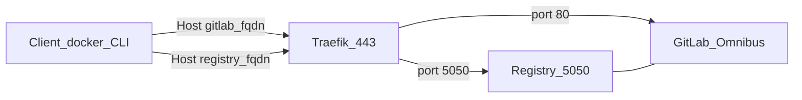
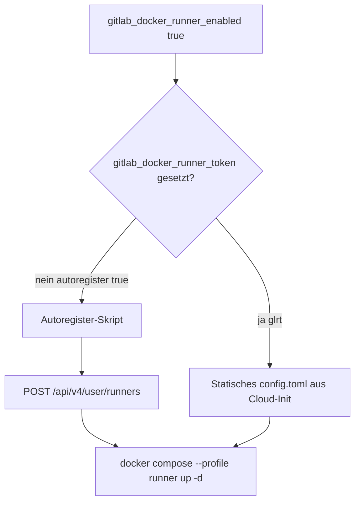
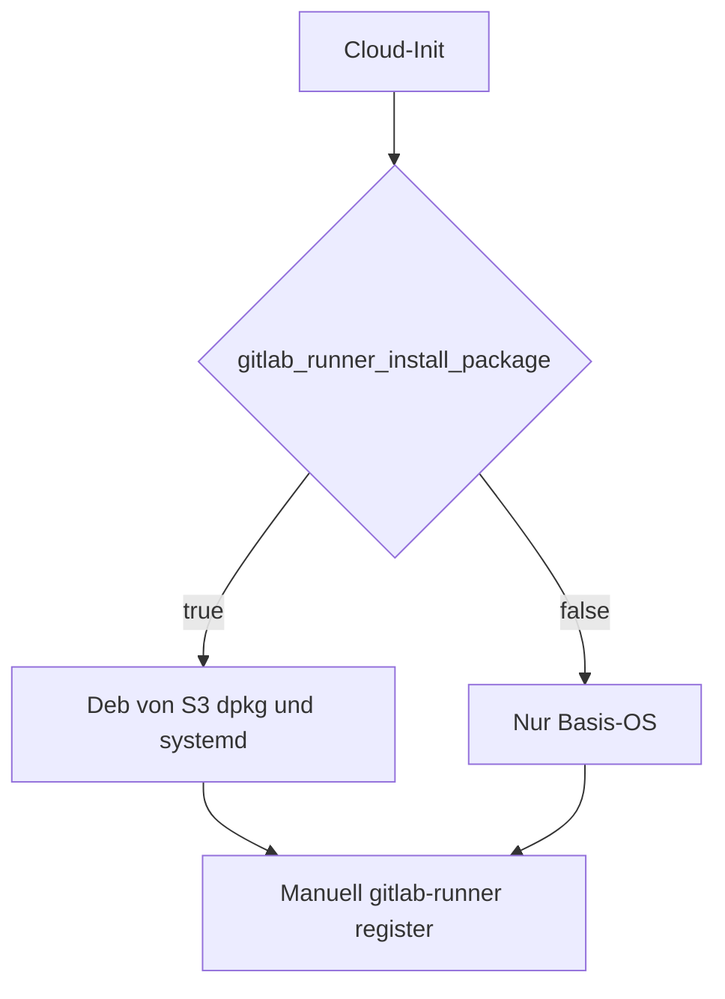

# GitLab-Installationsmodi

Steuerung über **`gitlab_install_mode`**: `none` | `hetzner_app` | `docker_compose` | `proxmox` (Default: `none`).

**Migration** von der früheren Variable `enable_gitlab_app`: `enable_gitlab_app = true` → `gitlab_install_mode = "hetzner_app"`; `false` → `"none"`.

### `hetzner_app` (Hetzner App-Image)

Wenn `gitlab_install_mode = "hetzner_app"`:

- Server-Image: **`gitlab`** (vgl. [hetznercloud/apps – GitLab](https://github.com/hetznercloud/apps/tree/main/apps/hetzner/gitlab)).
- Automatisierung: **systemd-Oneshot** `gitlab-terraform-bootstrap.service` + Hintergrund-**Scheduler** `/usr/local/sbin/gitlab-terraform-schedule-bootstrap.sh` (wartet bis `gitlab_setup` in `/root/.bashrc` sichtbar ist oder Timeout, dann `systemctl start`), damit der Dienst auch startet, wenn `enable` bei bereits aktivem `multi-user` nicht ausreicht. Zusätzlich wird **`/opt/hcloud/gitlab_setup.sh`** durch ein No-Op-Skript ersetzt (Fallback, falls noch ein Aufruf in der Shell-RC bleibt).
- DNS: A-Record **`gitlab_dns_record_name`** (Standard `gitlab`) → Server-IPv4; PTR (IPv4/IPv6) auf dieselbe FQDN, damit Zertifikatsprüfungen konsistent bleiben.
- **Let’s Encrypt:** Mit `gitlab_letsencrypt_enabled = false` (Standard) setzt Cloud-Init `external_url` auf **http**, schreibt **`letsencrypt['enable'] = false`** und **`letsencrypt['auto_enabled'] = false`**, setzt **`nginx['listen_https'] = false`**, und setzt in **`/etc/gitlab/gitlab-secrets.json`** ebenfalls **`letsencrypt.auto_enabled`** auf **`false`**. Grund: Omnibus kann LE sonst über die Auto-Enable-Heuristik und den in den Secrets persistierten `auto_enabled`-Schalter wieder aktivieren (siehe [MR !2353](https://gitlab.com/gitlab-org/omnibus-gitlab/-/merge_requests/2353)), selbst wenn zuvor schon Zeilen in `gitlab.rb` angepasst wurden.
- **Bootstrap erneut:** War früher `ExecStartPost` mit `touch` aktiv, kann **`/var/lib/gitlab-terraform/.bootstrap-done`** trotz fehlgeschlagenem `reconfigure` existieren — entfernen und `systemctl start gitlab-terraform-bootstrap.service` erneut ausführen (oder Server mit neuem `user_data` ersetzen). Aktuelles Template setzt `.bootstrap-done` **nur nach erfolgreichem** `gitlab-ctl reconfigure`.
- **Backups:** Mit **`gitlab_docker_backup_enabled = true`** (Standard) schreibt der Bootstrap `gitlab_rails` Backup-Einstellungen in **`/etc/gitlab/gitlab.rb`**. Optionaler Cron nur bei **`gitlab_docker_backup_auto_enabled = true`** (Zeit über **`gitlab_docker_backup_time`** oder **`gitlab_docker_backup_cron`**). Details: [backup.md](backup.md).

Offizielle App-Doku: [Hetzner Cloud Apps – GitLab CE](https://docs.hetzner.com/cloud/apps/list/gitlab-ce/).

### `docker_compose` (GitLab CE + Traefik)

Wenn `gitlab_install_mode = "docker_compose"`:

- Server-Image: **`gitlab_docker_host_image`** (Standard **`debian-13`**). Vor Produktion den Slug mit `hcloud image list` / Konsole prüfen.
- Cloud-Init ([`templates/gitlab-docker-cloud-init.yaml.tpl`](../terraform/templates/gitlab-docker-cloud-init.yaml.tpl)): installiert Docker Engine + Compose-Plugin, legt den Stack unter **`/opt/gitlab`** an und startet **`docker compose up -d`**. Log: **`/var/log/gitlab-docker-bootstrap.log`**.

**Persistenz auf dem Host** (Bind-Mounts statt anonymer Docker-Volumes):

| Host-Pfad | Container / Zweck |
|-----------|-------------------|
| `/opt/gitlab/traefik/traefik.yml` | Traefik-Statikconfig |
| `/opt/gitlab/traefik/.env` | Traefik-Umgebung (`HETZNER_API_TOKEN`, `ACME_EMAIL`, …) |
| `/opt/gitlab/traefik/dynamic_conf/` | Traefik File-Provider (Middlewares, `tls.yml`) |
| `/opt/gitlab/traefik/certs/` | ACME-Speicher (`acme_letsencrypt.json`, `tls_letsencrypt.json`) → `/certs` im Traefik-Container |
| `/opt/gitlab/postgres/data/` | PostgreSQL-Daten → `/var/lib/postgresql/data` |
| `/opt/gitlab/data/config/` | GitLab Omnibus → `/etc/gitlab` (inkl. **`gitlab.rb`**) |
| `/opt/gitlab/data/logs/` | GitLab-Logs → `/var/log/gitlab` |
| `/opt/gitlab/data/gitlab/` | GitLab-Anwendungsdaten → `/var/opt/gitlab` |
| `/opt/gitlab/backups/` | GitLab-Backup-Archive → `/var/opt/gitlab/backups` (wenn **`gitlab_docker_backup_enabled`**) |
| `/opt/gitlab/artifacts/data/` | CI job artifacts → `artifacts_path` (wenn **`artifacts_enabled`**) |
| `/opt/gitlab/scripts/gitlab-backup.sh` | Host-Skript für Cron (Application + `gitlab-ctl backup-etc`) |
| `/opt/gitlab/scripts/gitlab-restore.sh` | Restore: `--list`, `<BACKUP_ID>`, `--config-only` |
| `/opt/gitlab/registry/data/` | Registry-Blobs → `/var/opt/gitlab/gitlab-rails/shared/registry` (wenn **`gitlab_docker_registry_enabled`**) |
| `/opt/gitlab/registry/certs/` | Omnibus-Registry-Zertifikatsverzeichnis → `/etc/gitlab/ssl/registry` (öffentliches TLS via Traefik/ACME in `traefik/certs/`) |
| `/opt/gitlab/gitlab-runner/` | `config.toml` für **`gitlab/gitlab-runner`** (wenn **`gitlab_docker_runner_enabled`**) |
| `/opt/gitlab/scripts/gitlab-runner-autoregister.sh` | Bootstrap: Instance-Runner per API anlegen (wenn Autoregister aktiv) |

**GitLab-Konfiguration** folgt der [GitLab-Docker-Doku](https://docs.gitlab.com/install/docker/configuration/): Cloud-Init schreibt **`/opt/gitlab/data/config/gitlab.rb`** (im Container `/etc/gitlab/gitlab.rb`). Dort u. a. `external_url`, externe PostgreSQL, NGINX nur HTTP (TLS bei Traefik), `gitlab_rails['gitlab_shell_ssh_port'] = 2424`, **`gitlab_rails['gitlab_signup_enabled']`** (Terraform: **`gitlab_signup_enabled`**, Standard `false`). **`GITLAB_OMNIBUS_CONFIG`** wird nicht verwendet. Änderungen auf der VM:

```bash
editor /opt/gitlab/data/config/gitlab.rb
docker compose exec gitlab gitlab-ctl reconfigure
```

Initiales **`root`**: Umgebungsvariable **`GITLAB_ROOT_PASSWORD`** (Wert aus Terraform-`random_password`; Output **`gitlab_docker_initial_root_password`**, sensitiv, im **State**).

**E-Mail (SMTP):** Mit **`gitlab_smtp_enabled = true`** schreibt Terraform die [Omnibus-SMTP-Einstellungen](https://docs.gitlab.com/omnibus/settings/smtp.html) in `gitlab.rb` (`smtp_enable`, Adresse, Port, Auth, `gitlab_email_from`, …) und öffnet in der **Hetzner-Firewall** ausgehend **TCP auf `gitlab_smtp_port`**. Bei `false` wird `gitlab_rails['smtp_enable'] = false` gesetzt (keine SMTP-Egress-Regel). Nach Änderung: `gitlab-ctl reconfigure`.

**Backups (`docker_compose`):** Siehe [backup.md](backup.md) — Variablen, Cron vs. manuell, GitLab CI-Beispiel, Restore-Verweis. Host-Doku: **`/opt/gitlab/docs/BACKUP.md`**.

**Wichtig:** `gitlab-secrets.json` und `gitlab.rb` separat sichern ([Backup-Doku](https://docs.gitlab.com/administration/backup_restore/backup_gitlab/#data-not-included-in-a-backup)). Backups enthalten sensible Daten — Zugriff auf `/opt/gitlab/backups` einschränken und offsite kopieren.

**Traefik:** Image über **`gitlab_docker_traefik_image`**. Docker-Provider mit **`allowEmptyServices: true`**, damit der Router nicht fehlt, während der GitLab-Container startet (sonst kurz **404 page not found**). GitLab-Image-Healthcheck ist deaktiviert (`healthcheck: disable: true`), damit Traefik den Service nicht wegen `starting`/`unhealthy` ausblendet. Router für GitLab, **Registry** und Renovate mit Middleware **`default@file`** (gzip, Security-Headers, fail2ban-Plugin); Registry zusätzlich **Buffering** ohne Body-Limit für große `docker push`-Layer. Bei **`gitlab_docker_traefik_acme_enabled`**: Zertifikate per **DNS-01** (Resolver `hetzner`, Hetzner-API-Token in `.env`), optional TLS-01-Resolver `tls`; `letsencrypt` in `gitlab.rb` bleibt aus. Ohne ACME: **`gitlab_url`** und **`registry_url`** sind **`http://…`** — produktives `docker push`/`pull` über HTTPS erfordert ACME.

**Stack (Compose):**

| Service | Netze | Ports / Zugriff |
|---------|--------|-----------------|
| **traefik** | `proxy`, `socket_proxy` | Host **80/443**; statische IPs im `proxy`-Subnetz (`172.31.128.0/18`) |
| **postgres** | `socket_proxy` | nur intern; DB-Host `postgres` für GitLab |
| **gitlab** | `proxy`, `socket_proxy` | HTTP **:80** hinter Traefik (`gitlab`); optional Registry **:5050** (`registry`-Router); Git/SSH **Host 2424** → Container 22 |
| **gitlab-runner** | `proxy`, `socket_proxy` | Nur mit **`gitlab_docker_runner_enabled`**; bei Autoregister zunächst Compose-Profil **`runner`** (Start durch Skript) |
| **plantuml** | `socket_proxy` | Nur mit **`gitlab_docker_plantuml_enabled`**; Proxy `/-/plantuml/` über GitLab-NGINX |

Die **Hetzner-Firewall** öffnet **TCP 2424** (`enable_ssh_high`, Standard `true`) zusätzlich zu SSH 22 — passend zum Port-Mapping und `gitlab_shell_ssh_port`.

**Secrets:** DB-Passwort steht in `gitlab.rb` und im Terraform State (**`gitlab_docker_postgres_password`**). Traefik- und ACME-Werte: **`hetzner_api_key`**, **`gitlab_letsencrypt_email`**.

**TLS:** **`gitlab_docker_traefik_acme_enabled`** für HTTPS über Traefik; **`gitlab_letsencrypt_enabled`** nur für Omnibus (`hetzner_app`).

**DNS/PTR:** wie bei `hetzner_app` (A-Record `gitlab_dns_record_name`, PTR auf `gitlab_fqdn`).

### Web IDE (`docker_compose`)

Die [Web IDE](https://docs.gitlab.com/user/project/web_ide/) ist in GitLab CE 18.x enthalten (kein eigener Container). Voraussetzungen im Stack: **HTTPS** (`gitlab_docker_traefik_acme_enabled`), korrektes **`external_url`** in `gitlab.rb`, **Workhorse** im Omnibus-Image.

**Öffnen:** Im Projekt **Code → Open in Web IDE** oder Tastenkürzel **`.`** (Punkt).

**Admin (einmalig nach Deploy):**

| Thema | Wo / Was |
|--------|-----------|
| OAuth-Callback | **Admin → Applications → GitLab Web IDE** — Redirect-URL muss `https://<gitlab-fqdn>/-/ide/oauth_redirect` sein (passt zu `external_url`). |
| Extension Marketplace | **Admin → Settings → General → VS Code Extension Marketplace** aktivieren (optional, für Extensions). |
| Extension-Host | Im Admin-Feld **nur die Basis-Domain** (ohne `*.`, ohne `https://`), z. B. `cdn.web-ide.gitlab-static.net` — **nicht** `*.cdn.web-ide.gitlab-static.net` (liefert „not a valid domain name“). Wildcard-Subdomains entstehen automatisch; ausgehendes HTTPS zu `*.cdn.web-ide.gitlab-static.net` muss erlaubt sein. Eigene Domain (z. B. `web-ide.example.com`) nur mit DNS `*.web-ide…` + Traefik/nginx — siehe [Admin-Doku](https://docs.gitlab.com/administration/settings/web_ide/). |

Auf einer frischen Instanz OAuth-App und Callback per Rails anlegen (falls Admin-UI noch leer):

```bash
cd /opt/gitlab
docker compose exec -T gitlab gitlab-rails runner \
  'WebIde::DefaultOauthApplication.ensure_oauth_application!'
docker compose exec -T gitlab gitlab-rails runner \
  'ApplicationSetting.current.update!(vscode_extension_marketplace_enabled: true)'
```

**Nutzer:** **Preferences → Integrate with the Extension Marketplace** (wenn Extensions genutzt werden).

**Troubleshooting:**

| Symptom | Maßnahme |
|---------|----------|
| „Cannot open Web IDE“ / OAuth-Mismatch | Callback-URL in **Admin → Applications** prüfen; `external_url` muss dieselbe Origin nutzen ([Doku](https://docs.gitlab.com/user/project/web_ide/#update-the-oauth-callback-url)). |
| Leerer Editor / Asset-Fehler | Ausgehendes HTTPS zu `*.cdn.web-ide.gitlab-static.net` erlauben; Offline: [eigener Extension-Host](https://docs.gitlab.com/administration/settings/web_ide/). |
| HTTPS/SSL-Fehler | Traefik-ACME und Router (kein `tls.options=default@file` an Docker-Labels) — siehe Abschnitt Traefik oben. |

Weitere Details: [Web IDE](https://docs.gitlab.com/user/project/web_ide/), [Admin Web IDE](https://docs.gitlab.com/administration/settings/web_ide/), [Extension Marketplace](https://docs.gitlab.com/administration/settings/vscode_extension_marketplace/).

### Container Registry (`docker_compose`)

Standardmäßig aktiv über **`gitlab_docker_registry_enabled = true`** (nur mit `gitlab_install_mode = docker_compose`). Die Registry läuft im **GitLab-Omnibus-Container** (kein separater Service); Traefik terminiert TLS wie für die GitLab-Weboberfläche.



Quelldateien: [`docs/diagrams/registry-architecture.mmd`](diagrams/registry-architecture.mmd), [`docs/diagrams/registry-request-flow.mmd`](diagrams/registry-request-flow.mmd).

| Thema | Details |
|--------|---------|
| DNS | **`hcloud_zone_record.registry`** — A-Record **`<gitlab_docker_registry_dns_label>.<zone>`** (Standard `registry.<zone>`) → GitLab-Server-IPv4 |
| `gitlab.rb` | `registry_external_url`, `gitlab_rails['registry_enabled']`, `registry_nginx['enable'] = false`, `registry['registry_http_addr'] = "0.0.0.0:5050"` |
| Traefik | Router **`registry`** auf dem `gitlab`-Service → Port **5050**, `certresolver=hetzner` bei ACME |
| Volumes | `/opt/gitlab/registry/data`, `/opt/gitlab/registry/certs` |
| Deaktivieren | `gitlab_docker_registry_enabled = false` — kein DNS, keine Traefik-Labels, keine Registry-Einträge in `gitlab.rb` |

**Voraussetzung für HTTPS:** **`gitlab_docker_traefik_acme_enabled = true`** und gültiger **`hetzner_api_key`** (DNS-01). Nach Deploy:

```bash
dig +short registry.example.com
curl -sI https://registry.example.com/v2/
docker login registry.example.com
docker tag myimage:latest registry.example.com/group/project:latest
docker push registry.example.com/group/project:latest
```

Outputs: **`registry_fqdn`**, **`registry_url`**.

**Migration bestehender VMs:** Cloud-Init-Änderung → oft **Server-Replace** (`terraform apply -replace=module.server.hcloud_server.main`) oder manuell `gitlab.rb`, Volumes, Compose-Labels und `docker compose up -d` nachziehen, danach `gitlab-ctl reconfigure`.

Doku: [Container Registry](https://docs.gitlab.com/administration/packages/container_registry/), [Registry hinter Reverse Proxy](https://docs.gitlab.com/administration/packages/container_registry/#use-an-external-reverse-proxy).

### GitLab Pages (`docker_compose` / Proxmox-Docker)

Opt-in über **`gitlab_docker_pages_enabled = true`** (Standard `false`). Erfordert **`gitlab_docker_traefik_acme_enabled = true`** (Wildcard-TLS per DNS-01). Projekt-URLs: **`https://<namespace>.pages.<zone>`** (Label über **`gitlab_docker_pages_dns_label`**, Standard `pages`).

Details, DNS, CI-Beispiel und Troubleshooting: [pages.md](pages.md). Fehler „Support for domains and certificates is disabled“: [terraform/README.md](../terraform/README.md). Diagramm: [`docs/diagrams/pages-architecture.mmd`](diagrams/pages-architecture.mmd).

### Renovate CE (`docker_compose`)

Optional über **`gitlab_docker_renovate_enabled = true`** (nur zusammen mit `gitlab_install_mode = docker_compose`). Orientierung am offiziellen [Docker-Compose-Beispiel](https://github.com/mend/renovate-ce-ee/blob/main/examples/docker-compose/docker-compose-renovate-community.yml).

**Container-Stack auf der VM** (`/opt/gitlab/docker-compose.yml`):

| Service | Rolle |
|---------|--------|
| `renovate-ce` | Mend Renovate Community Edition (Server + Worker, SQLite unter `/db`) |
| Traefik | Reverse Proxy für `renovate.<zone>` → Container-Port **8080** |

**Cloud-Init schreibt zusätzlich:**

- `/opt/gitlab/renovate/mend-renovate.env` — Lizenz, TOS, API-Secret, Webhook-URL
- `/opt/gitlab/renovate/gitlab.env` — `MEND_RNV_PLATFORM=gitlab`, API-Endpoint (`https://<gitlab-fqdn>/api/v4/`), PAT, Webhook-Secret

**Terraform erzeugt:**

- `random_password.gitlab_renovate_webhook` → `MEND_RNV_WEBHOOK_SECRET` und (bei `enable_gitlab_resources`) Token des **`gitlab_project_hook`**
- `random_password.gitlab_renovate_server_api` → `MEND_RNV_SERVER_API_SECRET`
- **`hcloud_zone_record.renovate`** — A-Record auf die GitLab-Server-IPv4

**Beispiel `terraform.tfvars`:**

```hcl
gitlab_install_mode                = "docker_compose"
gitlab_docker_renovate_enabled     = true
gitlab_docker_renovate_license_key = "…"   # https://www.mend.io/renovate-community/
gitlab_docker_renovate_gitlab_pat  = "glpat-…" # PAT des Renovate-Bot-Users (api)

# Optional: GitLab-Projekt + Webhook per Provider
enable_gitlab_resources = true
gitlab_api_url          = "https://gitlab.example.com"
gitlab_api_token        = "glpat-…"
```

**Webhook:** GitLab sendet Events an `https://renovate.<zone>/webhook`. Der Hook auf Projekt `terraform` wird nur angelegt, wenn **`enable_gitlab_resources`**, **`docker_compose`** und **Renovate** gemeinsam aktiv sind ([`gitlab.tf`](../terraform/gitlab.tf)).

**Logs auf der VM:** `docker logs renovate-ce`; Bootstrap: `/var/log/gitlab-docker-bootstrap.log`.

### GitLab Runner im Compose-Stack (Autoregister)

Optionaler **`gitlab/gitlab-runner`** im **gleichen** Compose-Stack wie GitLab (nicht die separate Runner-VM unter [`enable_gitlab_runner`](#gitlab-runner-optionale-zweite-vm)). Orientierung: [Tutorial: Automate runner creation](https://docs.gitlab.com/tutorials/automate_runner_creation/).

**Steuerung in `terraform.tfvars`:**

| Variable | Standard | Bedeutung |
|----------|----------|-----------|
| `gitlab_docker_runner_enabled` | `false` | `true`: Runner-Service in `docker-compose.yml` |
| `gitlab_docker_runner_autoregister` | `true` | `true` + leerer Token → API-Bootstrap; `false` → Token manuell (`glrt-…`) |
| `gitlab_docker_runner_token` | `""` | `glrt-…` aus **Admin → CI/CD → Runners → New instance runner**; leer = Autoregister |
| `gitlab_docker_runner_description` | `docker-compose` | Name in GitLab und `config.toml` |
| `gitlab_docker_runner_tags` | `["docker"]` | Runner-Tags (API: kommagetrennt) |
| `gitlab_docker_traefik_proxy_ipv4` | `172.31.191.247` | Traefik-IP für Runner-`extra_hosts` (Coordinator-HTTPS vom Runner-Container) |
| `gitlab_docker_runner_executor` | `docker` | `docker` oder `shell` |
| `gitlab_docker_runner_image` | `gitlab/gitlab-runner:alpine-v17.11.0` | Runner-Container-Image |
| `gitlab_docker_runner_buildah_enabled` | `false` | Drei Buildah-Runner statt einem; siehe [runner-buildah.md](runner-buildah.md) |

**Buildah-Profile:** Mit **`gitlab_docker_runner_buildah_enabled = true`** registriert das Autoregister-Skript **drei** Instance-Runner (Tags per API: `buildah-rootless`, `buildah-privileged`, `buildah-multiarch`) in einer minimalen `config.toml` (`run_untagged`, schlanke `[runners.docker]`, kein `tag_list` in der Datei). Host: QEMU/binfmt für Multi-Arch. Details: [runner-buildah.md](runner-buildah.md).

**Zwei Betriebsarten:**



#### Automatisch (Autoregister, empfohlen)

Cloud-Init legt **`/opt/gitlab/scripts/gitlab-runner-autoregister.sh`** an und startet es im Hintergrund (`nohup`). Das Skript:

1. wartet, bis der GitLab-Container `running` ist (bis zu ~20 Minuten),
2. erzeugt kurz ein Root-PAT (`runner-bootstrap-terraform`, Scope `api`) per `gitlab-rails runner`,
3. ruft **`POST http://localhost/api/v4/user/runners`** im GitLab-Container auf (`runner_type=instance_type`, `description`, `tag_list`),
4. widerruft das Bootstrap-PAT,
5. schreibt **`/opt/gitlab/gitlab-runner/config.toml`** mit dem zurückgegebenen **`glrt-…`**-Token,
6. startet **`docker compose --profile runner up -d gitlab-runner`**.

Der Runner-Container nutzt bis dahin das Compose-Profil **`runner`** und wird **nicht** beim ersten `docker compose up -d` mitgestartet.

**Beispiel `terraform.tfvars`:**

```hcl
gitlab_install_mode                  = "docker_compose"
gitlab_docker_runner_enabled         = true
gitlab_docker_runner_autoregister    = true
gitlab_docker_runner_token           = ""   # leer lassen
gitlab_docker_runner_description     = "docker-compose"
gitlab_docker_runner_tags            = ["docker"]
gitlab_docker_runner_executor        = "docker"
gitlab_docker_runner_default_image   = "ruby:3.3"
```

**Logs:** `/var/log/gitlab-runner-autoregister.log` (auch bei manuellem Start unten).

**Erfolg prüfen:**

```bash
ssh root@<server_ip>
tail -30 /var/log/gitlab-runner-autoregister.log   # Zeile: runner autoregister ok
cd /opt/gitlab && docker compose ps gitlab-runner
```

In GitLab: **Admin → CI/CD → Runners** — Instance-Runner mit Beschreibung aus `gitlab_docker_runner_description`, Tags aus `gitlab_docker_runner_tags`.

#### Manuell (Token aus der UI)

Wenn du den Token selbst setzen willst:

```hcl
gitlab_docker_runner_enabled      = true
gitlab_docker_runner_autoregister = false   # optional; bei gesetztem Token wird Autoregister ohnehin übersprungen
gitlab_docker_runner_token        = "glrt-xxxxxxxxxxxxxxxxxxxx"
```

Cloud-Init schreibt dann direkt **`/opt/gitlab/gitlab-runner/config.toml`**; der Runner startet mit dem normalen **`docker compose up -d`** (ohne Profil-Verzögerung).

**Wichtig:** Nur **`glrt-…`** (Instance Runner), **kein** `glpat-…` (Personal Access Token).

#### Manuell auf einer bestehenden VM

Cloud-Init läuft nur beim **ersten** Boot. Auf einem bereits laufenden Server (z. B. nach Template-Update ohne Replace):

```bash
ssh root@<server_ip>
install -m 0700 -d /opt/gitlab/gitlab-runner
# Skript muss existieren (sonst erneut deployen oder aus aktuellem Cloud-Init kopieren):
ls -l /opt/gitlab/scripts/gitlab-runner-autoregister.sh
sudo /opt/gitlab/scripts/gitlab-runner-autoregister.sh
# parallel Log:
sudo tail -f /var/log/gitlab-runner-autoregister.log
```

Voraussetzungen: GitLab-Container läuft; `python3` auf dem Host (JSON-Auswertung); in `terraform.tfvars` war **`gitlab_docker_runner_enabled = true`** beim letzten Render des User-Data.

#### Troubleshooting

| Symptom | Maßnahme |
|---------|----------|
| Kein Container `gitlab-runner` | `docker compose ps` — nur mit Profil `runner` nach Skript; Log auf `user/runners API failed` prüfen |
| `attempt N: gitlab not running yet` | GitLab-Stack noch am Starten; warten oder `docker compose logs gitlab` |
| API-Fehler im Log | GitLab erreichbar? Root-User vorhanden? PAT-Erstellung in Log; GitLab-Version ≥ 16 (neuer Runner-Workflow) |
| Runner in UI, Jobs pending | Tags in `.gitlab-ci.yml` (`tags: [docker]`) müssen zu `gitlab_docker_runner_tags` passen |
| Artifacts/`pages` Upload schlägt fehl (`no such host` für `gitlab`) | `config.toml` → `url` muss die **öffentliche** Instanz-URL sein (`https://<fqdn>`), nicht `http://gitlab`. Der Runner-Container braucht `extra_hosts: [<fqdn>:<traefik-proxy-ip>]` (Terraform: `gitlab_docker_traefik_proxy_ipv4`), damit Coordinator-HTTPS intern über Traefik läuft |
| `connection refused` bei `https://<fqdn>` (Runner-Container) | FQDN zeigt intern auf GitLab-Container-IP ohne :443 — `extra_hosts` am `gitlab-runner`-Service setzen (siehe oben) |
| Skript fehlt | Server mit neuem `user_data` ersetzen oder Snippet/Cloud-Init erneut einspielen |

**Abgrenzung:** [`enable_gitlab_runner`](#gitlab-runner-optionale-zweite-vm) = **eigene Hetzner-VM** (`cpx22`) mit `.deb`-Installation; **kein** Autoregister-Skript aus diesem Abschnitt.

## GitLab-Provider-Ressourcen (`gitlab.tf`)

Steuerung über **`enable_gitlab_resources`** (Default: `false`). Das ist **unabhängig** von **`gitlab_install_mode`**: Du kannst z. B. nur Infrastruktur provisionieren, nur API-Ressourcen anlegen, oder beides kombinieren (Self-Hosted GitLab auf Hetzner + Projekte per Terraform).

Wenn **`enable_gitlab_resources = true`**:

| Ressource | Inhalt |
|-----------|--------|
| `gitlab_group.devops_group` | Gruppe mit Pfad `devops`, Name `DevOps` |
| `gitlab_project.devops` | Projekt `devops` in der Gruppe (`namespace_id`), `visibility_level = public` |
| `gitlab_project.terraform` | Projekt `terraform` im User-Namespace, `visibility_level = public` |
| `gitlab_user.renovate-bot` | Benutzer `renovate-bot` (E-Mail `renovate-bot@<zone>`) |
| `gitlab_group_membership.renovate-bot` | Bot als **Maintainer** in Gruppe `devops` |
| `gitlab_project_hook.renovate_bot` | Webhook auf Projekt `terraform` → `https://renovate.<zone>/webhook` (nur bei `docker_compose` + **`gitlab_docker_renovate_enabled`**) |

**Konfiguration** in `terraform.tfvars` (Beispiel):

```hcl
enable_gitlab_resources = true
gitlab_api_url          = "https://gitlab.example.com"  # oder https://gitlab.com
gitlab_api_token        = "glpat-…"                     # nicht committen
```

**Validierung** ([`variables.tf`](../terraform/variables.tf)): Ohne `enable_gitlab_resources` darf `gitlab_api_token` leer sein; mit `true` ist ein Token mit mindestens 8 Zeichen Pflicht. Image-Variablen für `docker_compose` haben Format-Checks (Hetzner-Slug, `traefik:…`, `gitlab/gitlab-ce:…`, `postgres:…`).

**Outputs:** `gitlab_devops_group_id`, `gitlab_devops_project_id`, `gitlab_terraform_project_id` (siehe [Outputs](reference.md#outputs)).

**Hinweise:**

- Der GitLab-Provider (v18) nutzt `visibility_level` statt `visibility`; Gruppenprojekte über `namespace_id`.
- Webhooks heißen im Provider **`gitlab_project_hook`** (nicht `gitlab_webhook`).
- Das Passwort des Bot-Users wird **nicht** per Terraform gesetzt (`#password` auskommentiert) — PAT manuell anlegen und in `gitlab_docker_renovate_gitlab_pat` eintragen.

## GitLab Runner (optionale zweite VM)

Für einen Runner **auf dem gleichen Host** wie GitLab (Docker Compose) siehe [GitLab Runner im Compose-Stack (Autoregister)](#gitlab-runner-im-compose-stack-autoregister) (`gitlab_docker_runner_*`). Dieser Abschnitt beschreibt eine **zweite Hetzner-VM**.

Wenn `enable_gitlab_runner = true`:

- **Server:** Zweites [`modules/server`](../terraform/modules/server) mit festem Typ **`cpx22`**, Image `gitlab_runner_image` (Standard Ubuntu 24.04), Region `gitlab_runner_location` oder wie `location`.
- **Firewall:** [`module.firewall_runner`](../terraform/modules/firewall) mit **SSH (22)** und **ICMP** eingehend; **ausgehend** DNS/HTTP/HTTPS (Defaults). Kein eingehendes HTTP/HTTPS/DNS/Node-Exporter.
- **DNS:** [`hcloud_zone_record.gitlab_runner`](../terraform/main.tf) in derselben Zone wie `dns_domain`; PTR zeigt auf **`gitlab_runner_fqdn`** (Standard `runner05.<zone>`).
- **Paket-Install:** `gitlab_runner_install_package` steuert Cloud-Init ([`templates/gitlab-runner-cloud-init.yaml.tpl`](../terraform/templates/gitlab-runner-cloud-init.yaml.tpl)): bei `true` [manuelle .deb-Installation](https://docs.gitlab.com/runner/install/linux-manually/) inkl. Arch-Mapping (`armhf`→`arm`), `dpkg`/`apt-get install -f`, `systemctl enable --now gitlab-runner`; bei `false` bleibt die VM ohne Runner-Paket.
- **Registrierung:** Kein `gitlab-runner register` in Terraform (Token würde im State landen). Nach dem Apply per SSH auf die Runner-VM verbinden und [Runner registrieren](https://docs.gitlab.com/runner/register/) (URL z. B. `terraform output -raw gitlab_url`, Token aus GitLab UI / CI-Variable).


