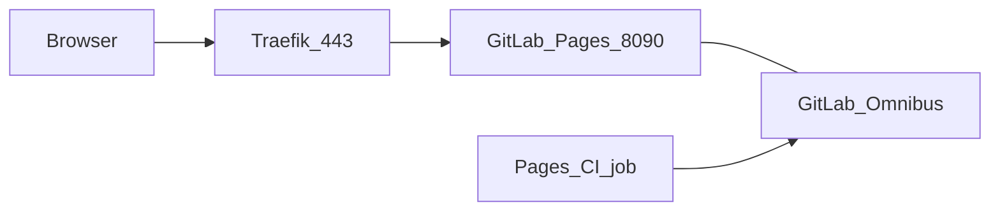

# GitLab Pages (Docker Compose / Proxmox-Docker)

GitLab Pages publishes static sites from CI jobs to per-project URLs such as `https://<namespace>.pages.<zone>`. This module enables Pages on the Omnibus GitLab container behind Traefik with wildcard DNS and a DNS-01 wildcard certificate.

## Terraform variables

| Variable | Default | Role |
|----------|---------|------|
| `gitlab_docker_pages_enabled` | `false` | Opt-in: `gitlab.rb`, Traefik router (port 8090), DNS |
| `gitlab_docker_pages_dns_label` | `pages` | Apex FQDN `pages.<zone>`; projects use `<namespace>.pages.<zone>` |
| `gitlab_docker_traefik_acme_enabled` | — | **Required** when Pages is enabled (HTTPS + wildcard cert) |

Supported install modes: `docker_compose` and Proxmox GitLab Docker stack (`proxmox` or legacy `proxmox_gitlab_docker_compose_enabled`).

Example:

```hcl
gitlab_docker_traefik_acme_enabled = true
gitlab_docker_pages_enabled        = true
gitlab_docker_pages_dns_label      = "pages"
```

## Architecture



Source: [`docs/diagrams/pages-architecture.mmd`](diagrams/pages-architecture.mmd).

| Component | Details |
|-----------|---------|
| DNS | A record `pages` and A record `*.pages` → GitLab host IPv4 (when Hetzner DNS is managed) |
| `gitlab.rb` | `pages_external_url`, `gitlab_pages['enable']`, `listen_proxy` on `8090`, `gitlab_pages['custom_domain_mode'] = 'http'`, `pages_nginx['enable'] = false` |
| Traefik | Router `pages`: `Host(pages.<zone>)` or `HostRegexp(^.<namespace>.pages.<zone>$)` → port **8090** |
| TLS | `certresolver=hetzner` with `main` + `sans=*.pages.<zone>` (DNS-01 wildcard) |
| Storage | Under existing bind-mount `./data/gitlab` → `/var/opt/gitlab/.../shared/pages` |

Outputs: `pages_fqdn`, `pages_wildcard_fqdn`, `pages_url`.

## DNS

When `manage_hetzner_dns` is true (typical Hetzner `docker_compose`):

- `pages.<zone>` → server IPv4
- `*.pages.<zone>` → same IPv4 (record name `*.pages` in the zone)

On Proxmox-primary setups without Hetzner DNS, create these records manually at your DNS provider.

Verify:

```bash
dig +short pages.example.com
dig +short mygroup.pages.example.com
```

## CI example

`.gitlab-ci.yml`:

```yaml
pages:
  stage: deploy
  script:
    - mkdir -p public
    - echo "Hello Pages" > public/index.html
  artifacts:
    paths:
      - public
  rules:
    - if: $CI_COMMIT_BRANCH == $CI_DEFAULT_BRANCH
```

After a successful job, GitLab shows the Pages URL (typically `https://<namespace>.pages.<zone>`).

## Checklist after apply

- [ ] `gitlab_docker_traefik_acme_enabled = true` and valid `hetzner_api_key` for DNS-01
- [ ] `dig` resolves apex and a test subdomain under `*.pages.<zone>`
- [ ] `curl -sI https://pages.<zone>/` returns a response (may be 404 without a site — TLS should work)
- [ ] Admin → **Settings → General → GitLab Pages** shows the expected domain
- [ ] Test project Pages job completes and URL loads over HTTPS

## Troubleshooting

| Symptom | Action |
|---------|--------|
| **„Support for domains and certificates is disabled“** (deploy / Admin → Pages) | Set `gitlab_pages['custom_domain_mode'] = 'http'` in `gitlab.rb` (Terraform does this when Pages is enabled), then `gitlab-ctl reconfigure`. See [terraform/README.md](../terraform/README.md). |
| 404 or TLS only on apex | Check wildcard DNS `*.pages` and Traefik `tls.domains[0].sans=*.pages.<zone>` |
| Pages job OK, URL unreachable | `docker compose exec gitlab gitlab-ctl status`; confirm Pages listens on 8090; `pages_external_url` matches DNS |
| No DNS answers | `manage_hetzner_dns` false → add records manually; wait for propagation |
| Certificate pending | Traefik logs under `/var/log/traefik/`; Hetzner API token in `traefik/.env` |

**Migration:** Cloud-Init changes often require server replace or manual update of `gitlab.rb`, Compose Traefik labels, DNS, then `docker compose exec gitlab gitlab-ctl reconfigure`.

## Not in scope

- `hetzner_app` Omnibus without this Traefik stack
- S3/object storage for Pages artifacts
- Per-group custom domains without wildcard DNS
