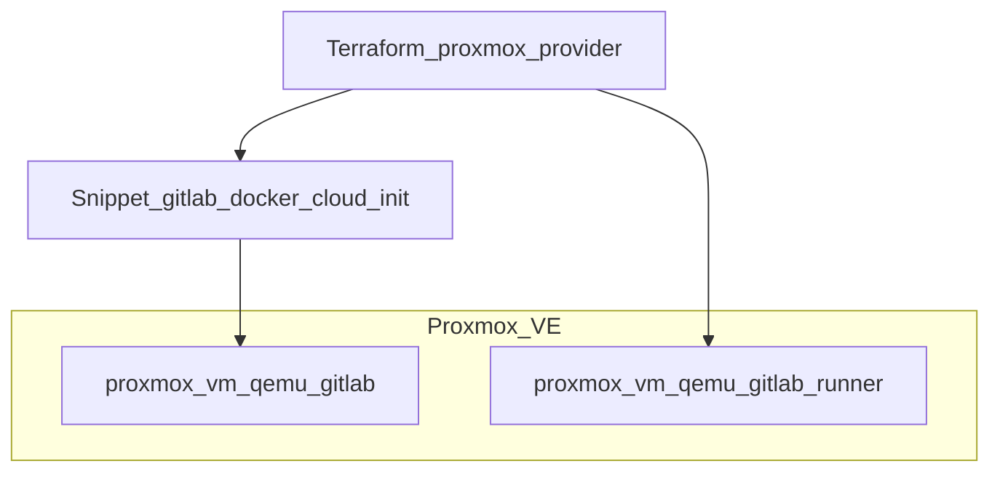

# GitLab auf Proxmox

Dieser Abschnitt dokumentiert die **Proxmox-Schienen** im Repo: Vorbereitung, Terraform-Variablen und geplante Schritte für **GitLab CE mit Docker Compose** auf einer QEMU-VM in Proxmox VE. Er wird bei neuen Anpassungen erweitert.

**Aktueller Stand:** Mit **`proxmox_gitlab_docker_compose_enabled = true`** (Default) lädt das Modul [`modules/proxmox`](../terraform/modules/proxmox) dasselbe Cloud-Init wie bei `gitlab_install_mode = docker_compose` als **Snippet** auf den Node und hängt es per **`cicustom = user=local:snippets/…`** an die GitLab-VM — Traefik, GitLab CE, PostgreSQL und optional Registry/Renovate wie auf Hetzner.

**Wichtig:** Proxmox und Hetzner sind **getrennte Schalter**. Für reines Proxmox empfohlen: **`gitlab_install_mode = "proxmox"`** + `enable_proxmox_resources = true` + `proxmox_gitlab_docker_compose_enabled = true` (inkl. kopiertem [`proxmox_data.tf`](../terraform/proxmox_data.tf.example) für VM-ID-Plan-Check). Legacy: `gitlab_install_mode = "none"` + `enable_proxmox_resources = true`. Dann ist **`module.dns` standardmäßig aus** (`local.manage_hetzner_dns = false`) — keine Hetzner-DNS-Zone/-Records per Terraform. DNS für GitLab/Registry legst du extern an oder Traefik ACME nutzt die Hetzner-DNS-**API** im Cloud-Init (`hetzner_api_key`), ohne Terraform-Records. Override: `enable_hetzner_dns = true` (z. B. Mail-Zone oder Runner-A-Record auf Hetzner).



### Voraussetzungen auf Proxmox

| Thema | Empfehlung |
|--------|------------|
| **Proxmox VE** | Getestet mit Provider `telmate/proxmox` `<=3.0.2-rc07` ([`provider.tf`](../terraform/provider.tf)) |
| **API-Token** | Unter **Datacenter → Permissions → API Tokens** anlegen; Token-ID und Secret in Terraform (siehe unten) |
| **QEMU Guest Agent** | In der VM aktiv (`agent = 1` im Modul); im Gast-OS installiert und laufend |
| **Netzwerk** | Bridge `vm_default_bridge` (Default `vmbr0`); VLAN-Tag `-1` = kein Tag |
| **Ressourcen GitLab-VM** | `vm_host_cores` (Default **4**), `vm_host_memory` (Default **12288** MiB) |
| **SSH** | `ssh_public_key` / `ssh_public_key_file` → `sshkeys` in Cloud-Init |
| **Snippet-Storage** | `proxmox_snippet_storage` (Default `local`); Upload per API bei Apply |
| **Template / Clone** | Optional `proxmox_enable_clone = true` + `clone_template`; sonst leere SCSI-Disk (`vm_default_disk_size`) |

### Einrichtung in Proxmox (Checkliste)

1. **API-Token** erstellen (Beispiel-Benutzer `terraform@pve`, Token-Name `terraform`):
   - Rechte mindestens zum Anlegen/Ändern von VMs auf dem Ziel-Node
   - Secret sicher notieren → `proxmox_api_token` in `terraform.tfvars`
2. **`proxmox_api_token_id`** setzen, falls abweichend (Default: `terraform@pve!terraform` = `USER@REALM!TOKENID`)
3. **`proxmox_api_url`** setzen: `https://<pve-host>:8006/api2/json` (exakt dieses Suffix, siehe Validierung in [`variables.tf`](../terraform/variables.tf))
4. **`proxmox_node`** auf den Cluster-Node-Namen setzen (`target_node` für die GitLab-VM)
5. **Netzwerk & Cloud-Init** per Variablen anpassen:
   - `proxmox_gitlab_ipconfig0`, `proxmox_runner_ipconfig0` (Runner nur mit `proxmox_enable_runner = true`)
   - `nameserver`, `ciuser`, `cipassword`
   - Für Traefik ACME (DNS-01): `hetzner_api_key` und `gitlab_docker_traefik_acme_enabled = true` wie bei Hetzner
6. **Terraform** (Proxmox-Dateien ins Working Tree kopieren, nicht committen — siehe `.gitignore`):
   ```bash
   cd terraform
   cp proxmox.tf.example proxmox.tf
   cp provider_proxmox.tf.example provider_proxmox.tf
   cp proxmox_variables.tf.example proxmox_variables.tf
   cp outputs_proxmox.tf.example outputs_proxmox.tf
   cp proxmox_data.tf.example proxmox_data.tf   # Pflicht bei gitlab_install_mode = "proxmox" (VM-ID-Check bei plan)
   terraform init    # lädt telmate/proxmox nur mit provider_proxmox.tf
   ```
7. In **`terraform.tfvars`** (Beispiel):
   ```hcl
   enable_proxmox_resources              = true
   proxmox_gitlab_docker_compose_enabled = true
   proxmox_api_url                       = "https://pve01.example.com:8006/api2/json"
   proxmox_api_token                     = "xxxxxxxx-xxxx-xxxx-xxxx-xxxxxxxxxxxx"
   proxmox_api_token_id                  = "terraform@pve!terraform"
   proxmox_node                          = "pve01"
   proxmox_gitlab_ipconfig0              = "ip=10.20.0.10/16,gw=10.20.0.1"
   pm_tls_insecure                       = true   # nur Lab; Produktion: gültiges TLS
   ciuser                                = "admin"
   cipassword                            = "…"
   ssh_public_key_file                   = "~/.ssh/id_ed25519.pub"
   gitlab_install_mode                   = "proxmox"   # oder Legacy: "none"
   proxmox_gitlab_vmid                   = 0         # 0 = auto; z. B. 120 = feste ID (Plan prüft Freiheit)
   proxmox_runner_vmid                   = 0
   dns_domain                            = "example.com"
   hetzner_api_key                       = "…"   # Traefik ACME DNS-01 (API, kein module.dns)
   # enable_hetzner_dns = null            # Default: kein Terraform-Hetzner-DNS bei Proxmox-only
   ```
8. **`terraform plan`** / **`apply`** — bei `gitlab_install_mode = "proxmox"` und VM-ID > 0: Proxmox-API muss für `plan` erreichbar sein ([`scripts/proxmox-check-vmids.sh`](../scripts/proxmox-check-vmids.sh)); lädt Cloud-Init-Snippet, erzeugt `proxmox_vm_qemu.gitlab`; Runner nur mit `proxmox_enable_runner = true`

### Terraform-Ressourcen

| Ressource | Ort | Zweck |
|-----------|-----|--------|
| `module.proxmox` | [`proxmox.tf`](../terraform/proxmox.tf) (Kopie von [`proxmox.tf.example`](../terraform/proxmox.tf.example)) | Wrapper mit Root-Variablen |
| `null_resource.upload_cloud_init_snippet` | [`modules/proxmox`](../terraform/modules/proxmox) | Upload `gitlab-docker-cloud-init.yaml.tpl` nach `snippets/` |
| `proxmox_vm_qemu.gitlab` | Modul | GitLab-VM mit `cicustom` + Cloud-Init-Netz |
| `proxmox_vm_qemu.gitlab_runner` | Modul | Optional (`proxmox_enable_runner`) |

**Lifecycle:** Änderungen an `disk` und `sshkeys` werden ignoriert (`ignore_changes`), damit manuelle Anpassungen in der UI nicht sofort zurückgedreht werden. `vm_state` ist **nicht** im `ignore_changes` (vom Provider nicht unterstützt).

### Variablen (Proxmox)

Steuerung: **`enable_proxmox_resources`** (Default `false`). Weitere Variablen in [`variables.tf`](../terraform/variables.tf) (Abschnitt „Proxmox variables“):

| Variable | Default (Kurz) | Rolle |
|----------|----------------|--------|
| `enable_proxmox_resources` | `false` | Schaltet `module.proxmox` |
| `proxmox_api_token` | `""` | API-Token-Secret; Pflicht wenn Proxmox aktiv |
| `proxmox_api_url` | `https://pve01…/api2/json` | Proxmox-API-Endpunkt |
| `proxmox_node` | `pve01` | Node für GitLab-VM |
| `proxmox_api_token_id` | `terraform@pve!terraform` | Token-ID für Provider + Snippet-Upload |
| `proxmox_gitlab_docker_compose_enabled` | `true` | Docker-Stack-Cloud-Init auf Proxmox |
| `proxmox_gitlab_ipconfig0` | `ip=10.20.0.10/16,…` | Statische IP GitLab-VM |
| `proxmox_enable_runner` | `false` | Zweite VM für Runner |
| `proxmox_enable_clone` | `false` | Klon aus `clone_template` statt leerer Disk |
| `proxmox_gitlab_vmid` / `proxmox_runner_vmid` | `0` | VM-ID; `0` = Auto; bei `proxmox`-Modus und ID > 0 Plan-Check gegen Cluster-VMs |
| `enable_hetzner_dns` | `null` (auto) | `null`/`false`: kein `module.dns` bei Proxmox-only GitLab; `true`: Zone/Records trotzdem |
| `pm_tls_insecure` | `true` | TLS-Verify für API aus |
| `pm_timeout` | `300` | API-Timeout in Sekunden ([telmate/proxmox](https://registry.terraform.io/providers/Telmate/proxmox/latest/docs)); 30–86400 |
| `pm_parallel` | `1` | Parallele Provider-Operationen; 1–32 (Integer), Standard 1 |
| `ciuser` / `cipassword` | `admin` / `""` | Cloud-Init (Passwort min. 8 Zeichen wenn aktiv) |
| `vm_host_cores` / `vm_host_memory` | `4` / `12288` | GitLab-VM |
| `vm_default_*` / `clone_*` / `scsihw` / `bootdisk` | siehe `variables.tf` | Runner-VM und Disk/Bridge/Storage |

Validierungen (Auszug): `proxmox_api_url` muss `https://…:PORT/api2/json` sein; `vm_default_bridge` z. B. `vmbr0`; `vm_default_disk_size` Format `20G` / `512M`.

### Nach dem Apply

1. Erster Boot: Cloud-Init installiert Docker und startet den Stack (wie `docker_compose` auf Hetzner).
2. **DNS:** A-Record `gitlab.<zone>` (und ggf. `registry.<zone>`) auf die erreichbare IP der VM — **manuell/extern**, wenn `enable_hetzner_dns` aus ist (Standard bei Proxmox-only).
3. **`gitlab_api_url`** für [`gitlab.tf`](../terraform/gitlab.tf) auf die erreichbare GitLab-URL setzen.
4. Root-Passwort: Output `gitlab_docker_initial_root_password` (sensitiv).
5. Optional **`enable_gitlab_resources = true`** für Gruppen/Projekte per API.

Snippet deaktivieren (nur Basis-Cloud-Init): `proxmox_gitlab_docker_compose_enabled = false`.

### Abgrenzung zu Hetzner-Modi

| | Hetzner (`gitlab_install_mode`) | Proxmox (`enable_proxmox_resources`) |
|--|--------------------------------|--------------------------------------|
| Compute | `hcloud_server` | `proxmox_vm_qemu` |
| Firewall | `hcloud_firewall` | Eigenes Netzwerk / Firewall am Host |
| DNS | `module.dns` / Records | Aus bei Proxmox-only (`enable_hetzner_dns` auto); sonst Hetzner DNS oder intern |
| GitLab-Stack | Cloud-Init-Template automatisch | Gleiches Template per Snippet + `cicustom` |
| Runner | `enable_gitlab_runner` (Hetzner) | `proxmox_enable_runner` (eigene VM, Runner-Install manuell) |

### Bekannte Punkte / Troubleshooting

- **`terraform init`:** Provider `telmate/proxmox` Version `<=3.0.2-rc07` (siehe Lockfile); neuere Provider-Versionen können abweichen.
- **Snippet-Upload schlägt fehl:** Token braucht Recht auf `proxmox_snippet_storage`; Storage muss `snippets` unterstützen (`local` auf dem Node).
- **Gleiche IP:** `proxmox_gitlab_ipconfig0` und `proxmox_runner_ipconfig0` müssen unterschiedlich sein, wenn Runner aktiv.
- **VM-ID belegt (Check `proxmox_vmid_available`):** Andere ID wählen oder `proxmox_gitlab_vmid` / `proxmox_runner_vmid = 0` für Auto; nur bei `gitlab_install_mode = "proxmox"` und kopiertem `proxmox_data.tf`.
- **Ohne Clone:** `proxmox_enable_clone = false` erzeugt eine leere SCSI-Disk — Gast-OS muss per ISO/anderem Weg installiert werden, oder Clone aktivieren.
- **Paralleles Apply** mit vollem Hetzner-GitLab (`gitlab_install_mode = docker_compose`) erzeugt **zwei** GitLab-Umgebungen — in der Regel nur eine aktivieren.

Weitere Links: [Proxmox VE API](https://pve.proxmox.com/pve-docs/api-viewer/index.html), [telmate/terraform-provider-proxmox](https://github.com/Telmate/terraform-provider-proxmox).
